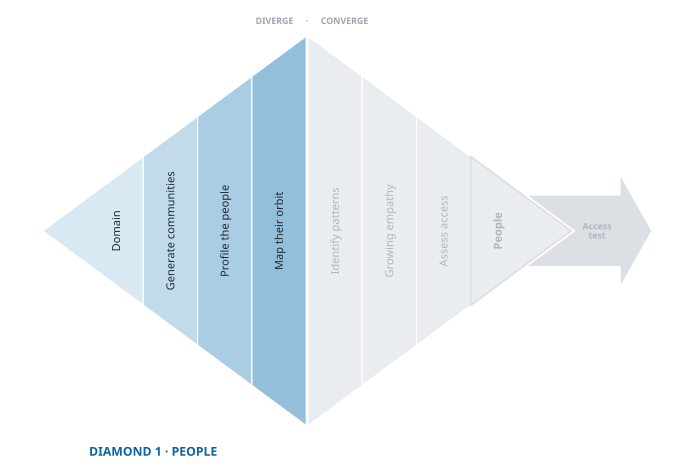

> "If you only fish where it's easy to cast, you may miss the part of the lake teeming with fish."

## Diverge: Looking for Neglect

{fig-align="center"}

Most entrepreneurs start with a hunch about *what* to build. Expeditionary innovation starts with *where to look*. This diamond begins not with a decision but with divergence: a deliberate effort to see widely before you commit to anything.

You are not hunting for the perfect group. You are looking for a community you can get to and where you have reason to expect neglect. Those are the only two requirements, and the second one is the interesting one, because neglect is **predictable**.

That is the payoff of the tyranny of the market. Firms build for the dense middle, so the further a group sits from that middle, the more likely its needs are going unserved. You are not searching at random and you are not waiting for inspiration. You have a map, and it tells you to look away from the centre.

The hard part is that the pull runs the other way. There is a strong temptation toward whoever is easy to reach: roommates, classmates, whoever answered the group chat. Choosing them is not a small shortcut. It is the most common way this phase fails, and it fails quietly. You will get interviews. You will get data. It will simply be data about the wrong people, and you will not find out until much later, when the pain you validated turns out to belong to nobody in particular.

## Anchor in a Problem Space

Every expedition needs a point of departure: a domain of friction, tension, or unresolved struggle. It can be broad ("stress in education") or narrow ("safety during the walk between subway and home"). What matters is that it *matters*, to real people, in tangible ways.

Start with a space, not a solution. Do not ask "what can we build?" Ask: *where is life harder than it needs to be?*

::: {.callout-tip title="Examples of Problem Spaces"}
- Food insecurity in mid-sized cities
- The burden of caregiving for aging parents
- Housing instability for gig workers
- Safety concerns for women commuting alone
- Quiet pressures faced by first-generation college students
:::

Notice what those have in common. Each names a *situation people live in*, not a product category and not a problem someone has already solved. "Better project management software" is a solution wearing a problem's clothes. "The chaos of coordinating volunteers across three congregations" is a place you could go and look.

## Generate Communities, Then Push Past the Obvious

With a problem space in view, list groups who live inside it. Some will be formal (veterans, refugee families), some loose (single parents, gig workers, late-night commuters). Range matters more than precision.

::: {.callout-tip title="Prompts for Community Generation"}
- Who experiences this problem most intensely?
- Who is largely ignored by existing solutions?
- Who has adapted in ways no one is paying attention to?
- Who is talking about this, but not being heard?
:::

Your first three answers will be the groups already in public conversation, and that is worth knowing about them. The groups that come to mind first are the ones in the news, and the news is a map of where attention already is. Attention attracts effort. Where a neglected group has advocates, journalists, funders, and nonprofits already working on their behalf, the space is not neglected in the way that matters to you, however real their difficulty is.

Parents of school-age children during the pandemic were genuinely struggling and were also the subject of a national conversation, a wave of new products, and a great deal of philanthropic money. Sympathy is not the same as opportunity. Ask not only *who is suffering* but *who is suffering while nobody is looking*.

So treat your first list as a warm-up. The useful groups are usually one step to the side of it: not the patients but the people who drive them to appointments, not the teachers but the substitutes, not the veterans but their adult children.

### A group is not a demographic

Here is the trap that catches the most ambitious teams, and it catches them *because* they are ambitious.

You pick a group that sounds impressively large. *Small business owners.* *College students.* *Working parents.* Then you interview twenty of them and the results come back incoherent: every conversation surfaces a different concern, nothing repeats, and you conclude these people have no shared pain.

They may well have one. But you would not have seen it. What happened is that you interviewed one or two people from each of a dozen genuinely different communities and then averaged them together. A dog groomer, a freelance illustrator, and a franchise restaurant owner are all small business owners, and they share almost nothing about how their days go wrong.

::: {.column-margin .def-margin}
**Community** — a set of people shaped by the same constraints, not merely sharing a category. Same pressures, same workarounds, same things that make a Tuesday hard.
:::

A community, here, is a set of people **shaped by the same constraints**. Not the same census box: the same pressures, the same workarounds, the same things that make a Tuesday hard. When you can say *these people all have to deal with X*, you have a group. When all you can say is *these people are all between 25 and 34*, you have a demographic, and demographics do not have pains.

The test is quick: could you write one sentence describing a bad day that most of this group would recognise? If not, the group is too broad.

Too broad is recoverable, and often it is where you should start. The failure is not choosing a wide group; it is choosing a wide group and then expecting one complaint to emerge from it. If you begin wide, plan to narrow, and watch for the moment when your conversations split into two or three distinct stories rather than one.

## Map the Orbit

No one navigates life alone. For each community, ask who else shapes their experience: family members, supervisors, landlords, caseworkers, dispatchers, moderators, coaches.

This does two things, and the second is the reason it belongs here.

It **keeps you from thinking too narrowly**. Problems rarely sit inside one person; they live in the friction between people, and the orbit is where that friction is.

It also **steers you off the obvious groups**. The person at the centre is usually the one already in the public conversation. The people in orbit are not, and they frequently carry more of the load. Everyone was talking about patients; nobody was asking the daughter who rearranged her work week to drive to the appointments. That daughter is a community, she is neglected, and she is reachable.

There is a practical bonus. Orbit roles are frequently your way *in*. If your community is hard to approach directly (nurses mid-shift, teenagers, people in crisis), the person beside them often is not, and a charge nurse or school counsellor or support-group moderator can open a door a cold message never will. Some of the orbit you map here becomes your access strategy two chapters from now.

---

Use the [People Divergence Sprint](toolkit/People_Diverge_Guide.qmd) from the toolkit to widen the net you cast in search of neglected or disenfranchised communities. Also review the [Halo Alert Demo](demo/exp-01-diverge-people-2025-02-19.qmd) to see how a team kept expanding their focus on commuters.

---

## How Wide Is Wide Enough?

There is no magic count, but there is a useful signal: keep generating until the groups stop being variations on the one you started with.

Most first lists are a single idea wearing five outfits: students, college students, undergraduates, freshmen, first-years. That looks like divergence and is not. You have actually diverged when the list holds groups that would require genuinely different research: different places to go, different people to ask, different assumptions to check.

A second signal. At least one group should make you slightly uncomfortable, because you know nothing about them and cannot picture their week. If you could describe every group confidently from your own experience, you have mapped your own life rather than the problem space.

## A Pause Before Convergence

At the end of divergence you are not ready to choose. You are ready to reflect.

Which communities seem most overlooked? Which live with friction that incumbents ignore and that nobody is already rushing to fix? Which are observable and reachable in practice?

Those questions belong to the next stage. But the strength of your choice depends on the breadth of your exploration now. Diverge widely and you escape the trap of convenience, resist premature guessing, and give yourself a real decision to make.
