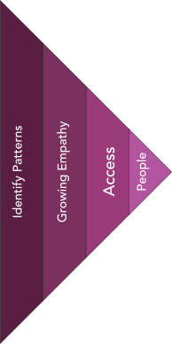

# Commit to a Community {#sec-converge-people-chapter}

#### Converge from many possible communities to your community of focus {.subtitle}

## Converge from Possibilities to Commitment {.unnumbered}

> “Choosing whom to care about is one of the most powerful decisions an innovator makes.”

{.wrapfig_right_25}
<!-- After opening wide in your search for possible communities, it’s time to narrow in — to converge. This is not a decision to rush. You’re choosing the people whose lives you’ll explore, whose unmet needs you’ll try to surface, and whose problems you may ultimately help solve.

This moment marks a quiet shift in mindset. You’re not picking the most interesting or convenient group. You’re identifying the community where your work has the greatest chance of making a difference — where friction is felt, where needs are unmet, and where empathy draws you in.

You don’t have to be certain. You just have to be ready to care.
-->
After diverging to explore a wide range of potential communities, the next step is to **converge** — to move from *possibilities* to a single, well-considered choice. This is more than selecting a study group. You’re choosing the people whose needs you’ll try to understand, whose pain you’ll explore in depth, and whose problems you aim to solve.

It’s a quiet but defining decision. Everything that follows — your discoveries, your designs, even your business model — will be shaped by this choice. If you’ve done the work of divergence well, you now have multiple promising communities in view. The goal is not to pick the one you like most or the one that feels most familiar. It’s to choose the group where your insights are likely to run deepest — and your innovation most needed.

## 1. Compare: Spot Patterns and Weigh Possibilities

::: {.callout-tip title="Prompt"}
Look across your divergent shortlist. Which groups show recurring struggles, clearer friction, or patterns that seem more persistent? Which ones blur or fade as less coherent?  
:::

When you look across the groups you identified during divergence, some will blur while others begin to sharpen. Patterns emerge. Frictions echo. Needs repeat.

Ask yourself: which groups show clearer signs of struggling? Which ones seem to face structural gaps or persistent misfits with current solutions? Which groups seem coherent — not just a random collection of people, but a community shaped by shared constraints?

This isn’t about choosing favorites. It’s about identifying where the signals are strongest. Innovation follows patterns — and the strongest patterns often hide in plain sight.

*For an example of how this looks in practice, see @sec-ha-people-converge-compare (the “Compare” section) of the [Halo Alert demo](demo/exp-02-converge-worksheet.qmd).*

## 2. Empathize: Follow the Emotional Pull

::: {.callout-tip title="Prompt"}
Which groups stay in your mind? Which stories linger? Which situations create a sense of urgency or injustice?  
:::

Some groups stay with you. Their stories resurface. Their frustrations stick. You find yourself returning to them in conversation — not because they’re flashy, but because they’re human.

This is empathy, not sentimentality. It’s a felt response to pain that matters. If you feel unsettled imagining this group left unserved, pay attention. That pull is not proof, but it is a signal. It often reveals where your energy — and insight — will go deepest.

Take note. Innovation grounded in empathy is more likely to endure.

*For an example of how this looks in practice, see @sec-ha-people-converge-empathize (the “Empathize” section) of the [Halo Alert demo](demo/exp-02-converge-worksheet.qmd).*

## 3. Assess Access: Can You Actually Reach Them?

::: {.callout-tip title="Prompt"}
A powerful need you cannot access is not an opportunity. Confirm that your group is observable, reachable, and willing to engage.  
:::

Insight requires access. No matter how compelling a group may seem, you need to be able to find them, observe them, and engage with them. A group that is too hidden, too protected, or too complex to reach will limit what you can learn — and who you can serve.

Ask three simple questions:

- Can we find them in the world (physically or digitally)?  
- Can we reach them through direct or indirect contact?  
- Are they willing to talk with us?

If the answer is no to any of these, consider revisiting your shortlist. Sometimes a great opportunity becomes feasible only after slight redefinition. Precision matters, but pragmatism keeps you moving.

*For an example of how this looks in practice, see @sec-ha-people-converge-access (the “Assess Access” section) of the [Halo Alert demo](demo/exp-02-converge-worksheet.qmd).*

## 4. Select Your People

With patterns observed, empathy noticed, and access considered, you’re ready to choose.

This choice is **provisional**, not permanent. You’re committing to a group for deep exploration — not marriage. Let the data shape your direction later. For now, anchor your attention. Name the group. Write down why you chose them. Begin to shift from wandering curiosity to deliberate discovery.

Innovation doesn’t begin with building. It begins with noticing — and that begins with choosing whom to notice.

Remember: this choice is **provisional**. Evidence may pull you toward a new definition later. But for now, this is the group you’ll commit to exploring in depth.

---

Use the [People Convergence Guide](toolkit/People_Converge_Guide.qmd) from the toolkit to guide your own decision-making, and review the [Halo Alert Demo](demo/exp-02-converge-worksheet.qmd) to see how another team narrowed their options and chose their people.

---

## What’s Next?

With your group selected, you’ll turn your attention toward understanding them. You’ll use interviews, observation, and immersion to surface the real pains they carry — often ones they can’t fully name. That work begins the next chapter of the expedition.

To support this phase of convergence, use the [People Convergence Guide](toolkit/People_Converge_Guide.qmd) from the toolkit. It will walk you through the same steps — but in a hands-on format, ready for sticky notes, reflection prompts, and worksheet tools.

Also revisit the [Halo Alert Demo](demo/exp-02-converge-worksheet.qmd) to see how another team used this convergence framework to make a thoughtful, human-centered choice.

## Attachments (for your Data Room)

At this stage, your team should create and store artifacts in your shared data room (e.g., Google Drive, Miro, Notion). Typical attachments include:

- Comparison table (CSV or Google Sheet)  
- Empathy reflection notes (txt, journal, or whiteboard photo)  
- Access test log (doc with attempted contacts or field notes)  

Use these as a prompt. Your team’s versions will look different, and that’s expected.

