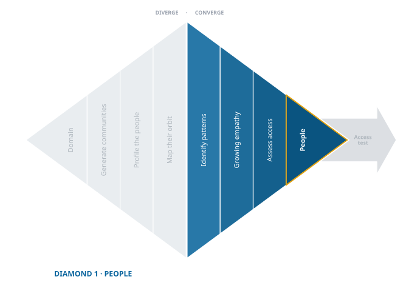

> "Choosing whom to care about is one of the most powerful decisions an innovator makes."

## Converge from Possibilities to Commitment {.unnumbered}

{fig-align="center"}

After diverging to explore a wide range of possible communities, the next step is to **converge**: to move from possibilities to a single, well-considered choice. You are choosing where to spend the next stretch of your attention: the community you will study closely enough that a pain can surface from it.

Remember that you are not naming your customers. That group is defined by a shared pain, and you do not know the pain yet. If you did the work of divergence well you now have several promising communities in view, and the goal is not to pick the one you like most or the one that feels most familiar. It is to choose the community where a real pain is most likely to surface, and where you can get close enough to see it.

Convergence is uncomfortable in a specific way. Every community you set aside is a search you are choosing not to run, and none of them has been ruled out. You are not eliminating bad options; you are giving up good ones so that one of them can have your full attention.

So do not throw them away. Put them in the refrigerator. Write down what you found promising about each one and where you would have started, and keep the note somewhere you can reach quickly. Nothing has been rejected; it is simply not the one you are working on this month. If the community you chose turns out to be wrong, you want the second choice waiting rather than reconstructed from memory.

## 1. Compare: Spot Patterns and Weigh Possibilities

::: {.reflect}
**Ask yourself**

Look across your divergent shortlist. Which groups show recurring struggles, clearer friction, or patterns that seem more persistent? Which ones blur or fade as less coherent?
:::

When you look across the groups you identified during divergence, some will blur while others sharpen. Patterns emerge. Frictions echo. Needs repeat.

Ask which groups show clearer signs of struggling, which face structural gaps or persistent misfits with current solutions, and which are coherent: not a random collection of people but a community shaped by shared constraints.

Two things are worth more than they look. Workarounds are the strongest signal available to you at this stage, because a workaround is proof that someone cared enough to build a fix themselves. And a group that already spends money or time on a partial answer has told you something a survey never will.

Be careful with the opposite signal. A group that is easy to describe is not the same as a group with a real problem. Some communities are highly visible precisely because they are already well served.

*For an example of how this looks in practice, see the [Compare section](demo/exp-02-converge-worksheet.qmd#sec-ha-people-converge-compare) of the Halo Alert demo.*

## 2. Empathize: Follow the Emotional Pull

::: {.reflect}
**Ask yourself**

Which groups stay in your mind? Which stories linger? Which situations create a sense of urgency or injustice?
:::

Some groups stay with you. Their stories resurface. Their frustrations stick. You find yourself returning to them in conversation, not because they are flashy, but because they are human.

This is empathy, not sentimentality. It is a felt response to pain that matters. If you feel unsettled imagining this group left unserved, pay attention. That pull is not proof, but it is a signal, and it usually shows where your energy and insight will go deepest.

It is also the most practical criterion on this page. Done with concentration, discovery is a week or two of work rather than a semester of it, but some of those days will feel like nothing is happening. Curiosity is what carries you through those days, and it is also most of the reward: learning how another person actually gets through a Tuesday is a privilege, and the entrepreneurs who feel that keep looking one conversation longer than the ones who do not. Choose a group you find merely *lucrative* and you will stop early, which is how you end up with a pain you assumed rather than found.

Be honest about where the pull comes from. Wanting to help is a good reason. Already knowing the answer is not: if you chose this group because you have a solution in mind for them, you have skipped two diamonds and are now looking for permission.

*For an example of how this looks in practice, see the [Empathize section](demo/exp-02-converge-worksheet.qmd#sec-ha-people-converge-empathize) of the Halo Alert demo.*

## 3. Assess Access: Can You Reach Them?

::: {.reflect}
**Ask yourself**

A powerful need you cannot get to is not an opportunity. Confirm that your group is observable, reachable, and willing to engage.
:::

Insight requires access. However compelling a group seems, you need to find them, observe them, and talk with them. A group that is too hidden, too protected, or too scattered will limit what you can learn and, later, who you can serve.

Ask three questions:

- Can we find them in the world, physically or digitally?
- Can we reach them through direct or indirect contact?
- Are they willing to talk with us?

This is an assessment, not yet a test. You are making a judgement from your desk about whether access looks plausible, so that you do not commit to a group that is obviously unreachable. The next chapter turns that judgement into evidence by actually trying. Skip the assessment and you waste a week. Treat the assessment *as* the evidence and you waste a month.

If the answer is “no” to any of the three, revisit your shortlist. Sometimes an opportunity becomes workable after a slight redefinition: not "people in crisis" but "the counsellors who work with them," not "surgeons" but "surgical residents."

*For an example of how this looks in practice, see the [Assess Access section](demo/exp-02-converge-worksheet.qmd#sec-ha-people-converge-access) of the Halo Alert demo.*

## 4. Commit to a Community

With patterns observed, empathy noticed, and access considered, you are ready to choose.

Name the group. Write down why you chose them, in a sentence you would be willing to show someone. Then write down the thing you are least sure about, because that is what the next chapter is going to test.

::: {.column-margin .def-margin}
**Provisional commitment** — a choice made firmly enough to act on and loosely enough to revise when the evidence says so. A working position, not a half-measure.
:::

This choice is **provisional** by design. That is not the same as being half-hearted about it. You are committing to a community for deep exploration, not naming a market. Evidence will almost certainly pull you toward a narrower definition later, because the group that matters is the one a pain defines, and that group only becomes visible from inside this one.

Provisional does not mean tentative. Half-committing is the worst of both worlds: you get the cost of the research without the depth that makes it worth anything. Commit fully, work as though this is the group, and let evidence be the only thing that moves you.

Two things should move you, and it helps to name them now so you recognise them later. **You cannot get access** despite genuine effort, which the next chapter will settle. Or **the group turns out not to be one group**, because the pains you surface do not overlap. The second usually means narrowing rather than starting over.

One thing should *not* move you: the work being harder or slower than you expected. That is not a signal about the group. That is what discovery is like.

Innovation does not begin with building. It begins with noticing, and noticing begins with choosing where to look.

---

Use the [People Convergence Guide](toolkit/People_Converge_Guide.qmd) from the toolkit to work through this decision with your team, and review the [Halo Alert Demo](demo/exp-02-converge-worksheet.qmd) to see how another team narrowed its options and chose its people.

---

## What's Next

With a community chosen, you will turn to understanding it. But first you will find out whether you can actually get to it. The next chapter runs the access test, the gate that closes this diamond.

## Attachments for Your Data Room

Store the artifacts from this stage where your team can find them later:

- the comparison table across candidate groups
- your empathy reflection notes
- an access log of attempted contacts and what came back
- the one-sentence statement of which community you chose and why

That last one matters more than it looks. In four weeks, when the evidence is messy and the group feels wrong, you will want to read what you believed at the start and see precisely which part of it turned out to be untrue.
