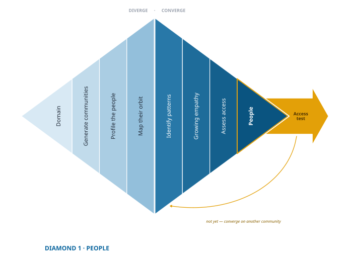

# Choose Where to Look {#part-choose-people}


## Why We Start With People {.unnumbered}

Every expedition begins with a choice of direction. In innovation, that choice is not about *what to build* but *where to look*.

{#fig-people-diamond-3 fig-align="center"}

> *The question this diamond answers: can you actually reach these people?*

## What You Are Actually Choosing {.unnumbered}

There is an awkward truth here, and it is easier to say plainly than to discover the hard way.

In the end you want a group of people who share a pain, because that is what a market is. But you cannot identify those people until you know the pain, and you cannot find the pain without spending real time among people. Each one requires the other. It looks like a trap.

The way out is to notice that this diamond is not choosing your customers. It is choosing where to look. What you need now is a community you can get to, observe, and talk with at length, and where you have some reason to expect neglect. That is all. Then in the second diamond, as the pain comes into focus, the group comes into focus with it.

::: {.column-margin .def-margin}
**A community to search** — the population you choose in this diamond, selected for access and expected neglect.

**Your people** — the group defined by a shared pain, which emerges in the second diamond. You do not have them yet.
:::

So we will be careful with words. Until a pain defines them, what you have is **a community to search**. The phrase **your people** is reserved for the group that emerges once you know what they share. You have not earned it yet, and that is not a failure of this stage. It is the point of it.

This is why teams reach the end of the process serving different people than they set out to study. Nobody made a mistake. The people you finish with are usually a subset of the people you began with, and occasionally a group you could not have named at the start. Expect it, and it stops being alarming.


## The Tyranny of the Market {.unnumbered}

Markets are not fair. They reward the mainstream and neglect the edges. Over time, incumbents cluster around the average customer, optimizing for the largest segment. That leaves others (smaller, harder to reach, or less visible) perpetually underserved.  

These people live under the *tyranny of the market*:

- Whatever is on offer never quite fits, and sometimes there is nothing on offer at all.  
- They adapt with workarounds, hacks, and compromises.  
- They quietly accept friction, delays, and risks as “normal life.”  

```{r}
#| label: fig-tyranny-market
#| echo: false
#| warning: false
#| fig-align: right
#| fig-cap-location: margin
#| fig-cap: In many markets, competitors converge on the largest customer segment, leaving fringe needs unmet. These edges are where expeditionary innovation takes root.
#| fig-width: 10
#| fig-height: 3.6
#| out-width: 100%
#| fig-asp: 0.35    # ~wide banner; adjust 0.30–0.40 to taste

library(tidyverse)

# --- Parameters -------------------------------------------------------------
mu    <- 3
sigma <- 1
x_min <- 0.5
x_max <- 5.5
edge_k <- 0.75           # width of "center" band (in SDs)
c_lo <- mu - edge_k*sigma
c_hi <- mu + edge_k*sigma

# --- Data -------------------------------------------------------------------
x <- seq(x_min, x_max, length.out = 600)
df <- tibble(
  x = x,
  y = dnorm(x, mean = mu, sd = sigma)
)

df_all    <- df
df_center <- df %>% filter(x >= c_lo, x <= c_hi)
df_left   <- df %>% filter(x <  c_lo)
df_right  <- df %>% filter(x >  c_hi)

inc_label <- "Incumbents cluster around\n mainstream customers"

#my_plot <- ggplot(df, aes(x, y)) +
ggplot(df, aes(x, y)) +
  # Areas
  geom_area(data = df_all,    fill = "grey85") +
  geom_area(data = df_left,   fill = "#0A659E", alpha = 1) +
  geom_area(data = df_right,  fill = "#0A659E", alpha = 1) +
  geom_area(data = df_center, fill = "grey75") +
  # Curve + baseline
  # geom_line(color = "royalblue3", linewidth = 1.6) +
  geom_hline(yintercept = 0, color = "black", linewidth = 1) +

  # Annotations
  annotate("text",
           x = mu, y = max(df$y) * 0.6,
           label = inc_label, size = 4.5, lineheight = 1.05) +
geom_label(
  data = tibble(
    x = c(x_min + 1.65, x_max - 1.65),
    y = c(max(df$y)*0.15, max(df$y)*0.15),
    lab = c("Underserved\nfringe", "Underserved\nfringe"),
    h = c(1, 0)
    ),
  aes(x = x, y = y, label = lab, hjust = h),
  size = 5,                  # slightly smaller for phones
  label.size = 0,              # no stroke border
  label.padding = unit(0.15, "lines"),
  label.r = unit(0.08, "lines"),
  color = "white",
  fill = "#0A659E",
  alpha = 1
  ) +

  # Labels
  xlab("Customer Preferences") + ylab(NULL) +

  # Vertical y-axis title just outside the panel  
  annotate("text",
         x = x_min + 0.02 * (x_max - x_min),  # a small nudge inside
         y = max(df$y) * 0.55,
         label = "Number of Customers",
         angle = 90, fontface = "bold", size = 5) +
  
  scale_x_continuous(limits = c(x_min, x_max), expand = c(0, 0)) +
  scale_y_continuous(limits = c(0, max(df$y) * 1.05), expand = c(0, 0)) +

  # Theme: minimal, no grid, tight margins for vertical label
  theme_minimal(base_size = 11) +
  theme(
    axis.title = element_text(size = 14, face = "bold"),
    axis.ticks  = element_blank(),
    axis.text   = element_blank(),
    panel.grid  = element_blank(),
    plot.margin = margin(5, 10, 10, 5)  # give the vertical label some room
  )

# Save ggplot as PNG
#ggsave("tyranny_market.png", plot = my_plot, width = 8, height = 6, dpi = 300)
# Save ggplot as SVG
#ggsave("tyranny_market.svg", plot = my_plot, width = 8, height = 6, dpi = 300)
```

The tyranny of the market is not a lapse that someone is about to correct. It is what a working market produces, which is why you can start almost anywhere and expect to find people whose needs go unmet. Do the work of ethnographic discovery, listening and observing and probing, and you will find them.

What that does not promise is that the needs you find will be reachable, or that any one of them is worth a business. Those are different questions, and this diamond and the next exist to answer them. The abundance of unmet need is what makes the search worth starting. It says nothing about where the search ends.


## Righting a Wrong {.unnumbered}

When you choose a group to study, you’re not just looking for opportunity. You’re stepping into an injustice: a place where people have been forced to make do because no one has designed with them in mind.  

Choosing people at the edges is an act of service. You are saying: 

- *We see you.*  
- *Your needs matter.*  
- *You deserve better than “good enough” — or better than nothing, which is what some of you have settled for.*  

That commitment doesn’t just build better ventures; it builds loyalty. People who have long been ignored rarely forget the first team that designed something truly for them.  

---

## Why Any Group Can Work {.unnumbered}

Entrepreneurs get stuck here, afraid that picking the wrong group will waste months. That fear is worth defusing, and now we can do it honestly.

The choice matters less than it feels like it should, because you are not choosing a target. You are choosing a search area. Almost any coherent community contains unmet needs, so the odds of picking a barren one are low, and if the group turns out to be the wrong shape you will discover that from inside it, while narrowing, rather than by starting over.

What you *can* do is choose *badly*: out of convenience, or so broadly that the group shares nothing but a label. Those choices cost real time, and they are common.

The constraint is rarely the market. It is access. Can you observe these people in context? Can you get real conversations rather than polite ones? Will they open up enough to show you what they have stopped noticing? This diamond ends with a test of exactly that, and the test exists because the answer is sometimes “no.” Finding that out in week two is cheap. Finding it out in month four is not.

---

## What This Part Covers {.unnumbered}

In this part of the book, you will learn how to:

1. **Diverge** — cast a wide net across possible communities, looking for neglect rather than for the obvious.
2. **Converge** — compare, empathize, and assess access to settle on one community to search.
3. **Test Access** — confirm you can reliably reach and engage them.

Alongside the narrative chapters you will find practical guides and demonstrations from the Halo Alert project, showing how these methods play out.

By the end of this part you will not have chosen a target audience. You will have committed to a community you can actually study, which is the only thing you are in a position to commit to yet.


::: {.callout-note title="How to Use This Part"}
Each stage of this diamond — diverge, converge, test — is supported three ways:

- **Chapter** — explains the *why* and the big ideas.
- **Guide** — a step-by-step worksheet you can use directly.
- **Demo** — shows how the Halo Alert team did it in practice.

The chapter teaches, the guide directs, and the demo proves it is doable.

Do not stop at reading. Pair each chapter with its guide, then study the demo to see how real evidence gets gathered.
:::


