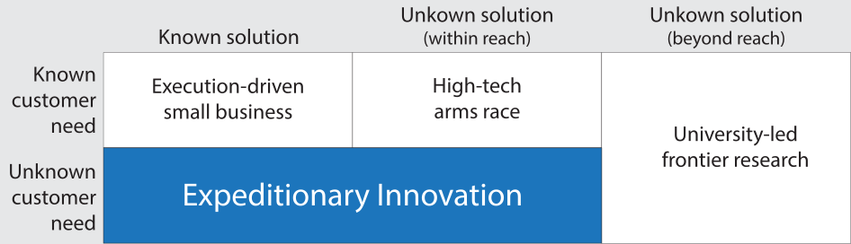
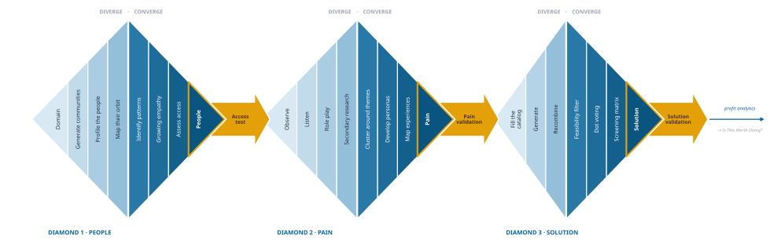
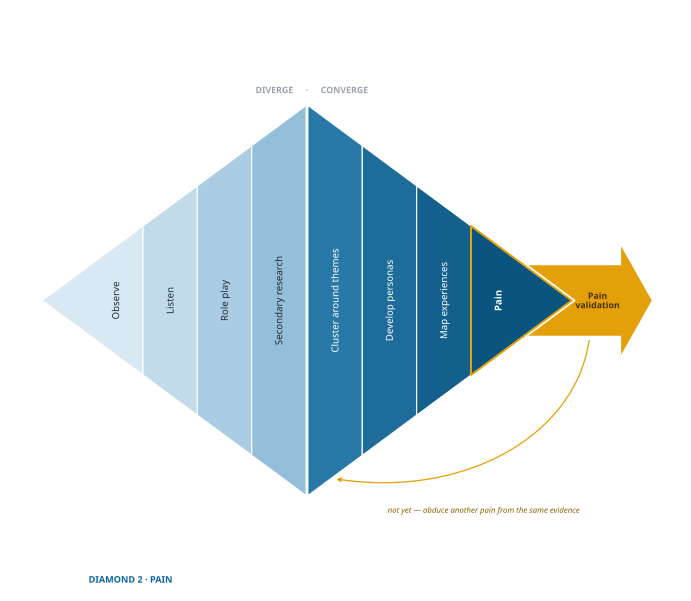
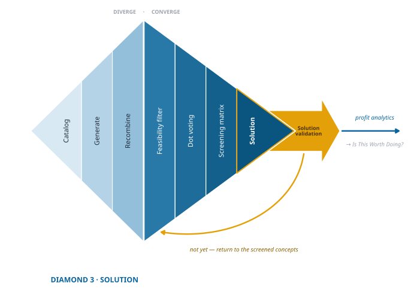

# Expeditionary Innovation {#sec-expeditionary-innovation-chapter .unnumbered}

## What Expeditionary Innovation Is — and Isn't {.unnumbered}

The word *expedition* comes from the Latin *ex* (out) and *ped* (foot): to stride out, to clear obstacles, to move with purpose. That is what this is. A journey into unfamiliar territory with a clear aim, where each step clears the way for the next. Not wandering, which has no aim. Not a commute, which has a known route. An expedition goes out to find something, and comes back with it.

"Innovation" gets used for almost everything, so it is worth being precise about which kind this book is about. Sort innovation by two questions, and the picture clarifies quickly: *do you know what people need, and do you know how to build it?*

That second question has two versions, and the difference decides who can play. Amazon's one-click ordering was **within reach**: nobody had built it, but the programming and the internet were sitting right there waiting. Self-driving cars were **beyond reach**: somebody first had to build sensors and control systems that did not exist, and no amount of cleverness with existing parts would have produced them.

::: {.column-margin .def-margin}
**Within reach** — everything needed to build the solution already exists; it has simply never been put together this way.

**Beyond reach** — someone must first discover something new before the solution is possible at all.
:::

{#tbl-innovation-typology fig-align="center" fig-cap-location="margin"}

Each box in that table is a real and worthy kind of innovation. They are not equally good places for you to stand.

## Why the Other Paths Are Harder {.unnumbered}

**When the need is known and the solution is known**, you are competing on execution. Someone already sells this thing and everyone knows how to make it. You win by being cheaper, faster, friendlier, or closer to the customer. Plenty of excellent businesses live here. What you will not find is an innovation premium: whatever margin you earn, a competitor can copy, and eventually will.

**When the need is known but the solution is not**, you are in a race against companies whose entire business is already organized around that need. They have the engineers, the distribution, the brand, and a decade of improvements you would have to match. This is a fair fight only if someone on your team can outperform dedicated professionals at the thing they do all day. Sometimes that person exists. Usually they do not.

**When the need is known and no one yet knows how to solve it**, somebody has to push out the boundary of what is known. That is the work of scientists and specialists working at the frontier, on timelines and budgets that look nothing like a startup's. If you have that person, this can pay extraordinarily. Most teams do not.

**When both the need and the solution are unknown, and the solution is beyond anyone's current reach**, two rare things have to happen and then line up: the frontier has to move, and somebody has to notice that the movement now serves a need nobody had articulated. That does happen. Semiconductors and freeze-dried food came out of the effort to reach the moon. But two rare events coinciding is not something you can plan to do on purpose. It is a story you tell afterward, not a strategy you set out with.

**Which leaves the box this book is about:** the need is unknown, and the solution is within reach. Nobody has noticed that these people are struggling. Once you notice, building the answer is mostly a matter of ordinary competence rather than genius. Chobani did not invent Greek yogurt; the recipe was centuries old. What Hamdi Ulukaya knew that nobody else had acted on was that Americans would want it.

That box has three properties the others don't.

**There is no direct competitor.** Not because you outran anyone, but because nobody else has noticed the need yet. You are not taking share; you are opening ground.

That advantage does not vanish the day a rival arrives, which is the part founders assume and get wrong. What you carry out of this process is a picture of the market that nobody else holds, and holding a different picture from your competitors turns out to be worth money in its own right.

::: {.for-curious}

For the Curious — Why a different view of the market pays

Nile Hatch and James Ostler model firms entering a new and uncertain market while holding different mental representations of it, crossing how much attention a firm pays to rivalry with how much it pays to uncertainty [@hatchCognitiveExposureHow2026].

Two results bear on this book. **Firms holding identical representations underperform**, so there is a premium to seeing the market differently from your rivals — matching their view is the losing move, not the safe one. And **a representation that combines awareness of rivals with flexibility largely insures its holder against the rival's thinking**, where flexibility means keeping your options open until the uncertainty is resolved. That is a formal description of what this method builds.

There is a caution in the same work. A firm's performance depends heavily on its *rival's* representation, often more than on its own — but that exposure is concentrated among firms that are blind to rivalry altogether. Discovering an unmet need does not license you to stop watching who else is coming.

This is a model, not a field study. It shows what follows from a set of assumptions, which is a different and weaker kind of evidence than observing it happen.

:::

**Your customers will pay a premium and be glad to.** They have been making do with something that almost fits. When something finally fits, the relief is worth real money to them.

**You get a head start.** Incumbents do not respond to a niche until it is large enough to show up in their numbers, and that takes time. Across the teams I have advised, the window before a serious imitator arrives has tended to run something like two to five years. Long enough to get established. Short enough that you should spend those years building the advantages that will still hold when rivals arrive.

This is also why the method works for people who don't consider themselves creative. The hard part is not inventing something clever, it is noticing something true. Follow the process and you will look like the most creative person in the room, not because you guessed well, but because you looked where nobody else was looking. Diamond 3 will teach you technique for generating solutions, and technique turns out to substitute for talent surprisingly well.

## Why the Edges Stay Open {.unnumbered}

There is an obvious objection to everything above, and you should raise it before an investor does. *If these needs are real and profitable, why hasn't someone already served them?*

The answer is the most important idea in this book.

Building something new costs money, and that cost has to be recovered from the people who buy it. So companies aim where customers are densest — the middle of the market, where the volume makes the numbers work. Competitors aim there too, because that is where the volume is. They pile on features. Prices come down.

And here is the part that matters: none of that helps the people at the edges, because *a lower price on a product you don't want is not a better deal*. Competition operates on price. Their problem is fit. More competition in the middle does nothing for them, ever. This is not a market failure that someone is about to correct. It is what a market functioning normally produces, and it is why those needs are still sitting there. Joel Waldfogel named it the **tyranny of the market** [@waldfogelTyrannyMarketWhy2009].

::: {.column-margin .def-margin}
**Tyranny of the market** — customers whose preferences are less common go unserved, because firms build for where customers are densest. Not a failure of the market. A consequence of it working.
:::

So the needs are not hidden because nobody is clever enough to see them. They persist because serving them has never been worth it *to a company built for the middle*. That is a statement about the incumbent's cost structure, not about the opportunity.

Which raises the real question, and the one your whole process exists to answer: *why can you serve this edge when they can't?* There are usually four honest answers, and at least one of them has to be true for you.

- **You don't need their volume.** A market too small to move a large company's numbers can be an excellent business at your scale.
- **The cost of building has fallen.** What once required a factory now requires a laptop. Needs that were genuinely unservable in 2005 became servable without anyone noticing.
- **A way to reach them now exists.** Scattered customers who were once impossible to find can now be reached directly and cheaply.
- **You will treat the niche as a destination.** A large company sees a small market as not worth entering. You can see it as enough.

This is the same mechanism behind *disruptive innovation*. Incumbents do not miss the low end because they cannot see it. They skip it because their margins make serving it irrational, right up until the entrant who took it grows into something they cannot dislodge [@christensenInnovatorsDilemmaWhen1997; @christensenInnovatorsSolutionCreating2003].

We will return to this with a picture of how competitors crowd the middle and leave the edges open, in @fig-tyranny-market in the *Choose Where to Look* part.

## Finding the Edges {.unnumbered}

So how do you spot them? By paying attention to signals most companies ignore.

Look for people who don't fit the mold:

- cobbling together multiple products just to make things work,
- inventing hacks or awkward routines to get by,
- buying "close enough" but never "just right."

Listen for pain hiding in plain sight:

- complaints that keep resurfacing in forums or reviews,
- sharp frustrations tucked inside otherwise positive feedback,
- stories of delay, confusion, or vulnerability brushed off as "just part of it."

The temptation will always be to round your idea back toward the middle, where the customers seem to be. Resist it. The fit that feels too specific is usually the one that matters.

## From Edge to Innovation: The Triple Diamond {.unnumbered}

The process is built around the **triple diamond framework**, an extension of the well-known double diamond model.[^2] Each diamond is a phase of structured work that widens to explore, narrows to decide, and then tests before you move on.

[^2]: The triple diamond extends the double diamond model popularized by the UK Design Council [@designcouncilDesignProcessWhat2015], which organizes innovation into two cycles of divergence and convergence: defining the problem and developing the solution. Expeditionary innovation adds a first diamond—choosing the right people—because starting with the wrong group undermines the entire process. The double diamond assumes you already know whom you are designing for; that assumption is the one this book refuses to make.

{#fig-triple-diamond fig-align="center"}

The diamonds are not three arbitrary stages. Each one settles one of the three things that must be true for any of this to be a business rather than an interesting observation.

------------------------------------------------------------------------

### Diamond 1: Choose the Right People

> *The question: can you actually get to these people?*

Innovation begins not with an idea but with *people*. You diverge by exploring a wide range of possible groups. Using structured criteria, you converge on one to study in depth. Then you run an **access test** to confirm you can reach them in meaningful numbers.

That last step is the one most frameworks skip, and it is not a formality. If you cannot reach the people, you do not have an opportunity. You have a hypothesis you can never test, and later, customers you can never sell to.

By the end of this diamond, you should have **evidence of access** to a specific group you can reliably reach and engage.

{#fig-people-diamond fig-align="center"}

------------------------------------------------------------------------

### Diamond 2: Understand an Unmet Need

> *The question: does it cost them enough that they would pay to make it stop?*

This is where **exploratory experiments** become the engine of discovery.

#### What Are Exploratory Experiments?

Exploratory experiments are open-ended, discovery-oriented investigations.[^3] Rather than starting from a fully formed hypothesis, you begin with curiosity and go looking — using observation, conversation, and immersion to find out what you don't yet know. They are designed to:

- surface unmet needs that customers may not articulate directly,
- identify patterns and anomalies in behavior or context,
- generate new questions rather than confirming assumptions you arrived with.

Exploratory work is what makes a hypothesis worth testing, and it has a name. When surprises start to accumulate and point the same direction, you reason backward to the explanation that best accounts for all of them. That move is called **abduction**, and it is what separates a grounded hypothesis from a guess dressed up as one. You will spend most of Diamond 2 learning to do it well.

::: {.column-margin .def-margin}
**Abduction** — reasoning from a set of surprising observations to the explanation that would best account for all of them. Not deduction, which derives from rules, and not induction, which generalises from cases.
:::

<!-- Claude 2026-07-30: this footnote cited Hacking's *The Emergence of Probability* (2006),
which is a history of the probability concept and says nothing about experimentation. The
claim being made — experiment running ahead of theory — is *Representing and Intervening*
(1983), which is also what Steinle and Burian cite. Repointed. I could NOT verify the
quoted word "adventure" in either book, so I've paraphrased rather than quote something
unverified; restore the quotation if you can source it. NB: the same "experiment-as-
adventure" phrasing appears in Make the Call — worth checking there too. -->
[^3]: The philosopher of science Ian Hacking [-@hackingRepresentingInterveningIntroductory1983] argued that experimentation has a life of its own: observation and intervention often run ahead of theory rather than following from it, inviting a guess at what might happen before seeing what will happen. While most experiments in science have historically been confirmatory, exploratory experiments are now recognized as a distinct and essential category [@steinleEnteringNewFields1997; @steinleExperimentsHistoryPhilosophy2002; @burianMicroRNANeedExploratory2007].

#### How They Fit the Process

- **Diverge:** immerse yourself in the world of your chosen people through observation, conversation, shadowing, and reflection.
- **Converge:** use thematic analysis, personas, and experience maps to reason your way to the explanation that best accounts for what you saw.
- **Test:** form a *pain hypothesis* — a testable claim about an unmet need — and run a **pain validation test** to see whether the problem is real and costly.

By the end of this diamond, you should have a **validated pain**: an unmet need you have confirmed is real, frequent, and urgent enough that your people are already spending time or money to relieve it.

{#fig-pain-diamond fig-align="center"}

------------------------------------------------------------------------

### Diamond 3: Build the Right Solution

> *The question: is there a solution they will actually take up, and can you build it?*

With a validated pain in hand, you can move quickly through solution generation and confirmatory testing:

- **Diverge:** generate a wide range of ideas, aiming for a hundred or more using rapid ideation tools.
- **Converge:** apply feasibility filters and scoring to identify the most promising concept.
- **Test:** run a progression of confirmatory tests — desirability, usability, viability — culminating in a smoke test and profit analytics.

Here confirmatory experiments dominate. Their job is to show that your solution works, that it works *for the right people*, and that it solves *the right problem*.

By the end of this diamond, you should have a **validated solution concept** and prototype evidence that you can solve the need and that customers will buy.

{#fig-solution-diamond fig-align="center"}

------------------------------------------------------------------------

### Why This Sequence Matters

Read the three questions in order and the logic of the whole method comes into view:

1. Can you reach these people?
2. Does their pain cost enough that they would pay to relieve it?
3. Is there a solution they will take up, and can you build it?

Each one has to be answered *yes* before the next one is worth asking. Answer any of them *no* and you have learned something valuable for the price of a few weeks rather than a few years. That is the entire bargain.

It also explains why shortcuts hurt. Skipping the access test, or gathering pain evidence from whoever is convenient, or picking a solution first and looking for support afterward — each one skips the retirement of a specific risk and leaves you carrying it without knowing you are.

There is a fourth question, and it is the one that finally decides: **is this worth doing?** Reaching people, relieving a real pain, and building something they will adopt still does not tell you whether the business earns more than it costs. That question needs its own methods — estimating profit before any revenue exists — and it has its own book: [*Is This Worth Doing?*](https://ea.nilehatch.com/). Finish the expedition first. You cannot evaluate a venture you have not yet found.

## Begin the Expedition {.unnumbered}

The journey from edge to evidence is not a straight line. The triple diamond lets you walk it with purpose: choose the right people, discover and validate an unmet need, then design and test a solution that relieves it.

Do this and you will build for people who have been overlooked, who will gladly pay for a solution nobody else offers, and who will tell others. You will have a window before the market reacts. And you will have replaced guessing with evidence at each of the three points where guessing usually kills a venture.

None of that guarantees success. Plenty of uncertainty remains that no method touches. What the process does is remove the uncertainty that was removable, so that what you finally risk is only what could not have been known in advance.

It is fair to ask whether that is worth the trouble, since the resolving costs you weeks you could have spent building.

::: {.for-curious}

For the Curious — Whether resolving uncertainty pays for itself

The question has been modelled. Hatch and Ostler compare firms that enter a new market as soon as they are able against firms that first run experiments to resolve what they do not know about the customer, and they find the second group more profitable — **after charging the experiments' cost and delay against them** [@hatchPerformanceEffectsCompeting2018]. The later work extends the comparison to competition, where flexibility of this kind also protects a firm against its rival's decisions [@hatchCognitiveExposureHow2026].

Two honest qualifications. These are simulations rather than field studies: they show what follows from a set of assumptions about how markets and rivals behave. And both are working papers rather than published findings.

What they establish is narrower than "this method works," and more useful: **the time you spend finding out is not a tax on the venture.** It is part of what makes the venture worth more than the alternative of building first and asking later.

:::

Begin your expedition. You will know the next step from here on.
