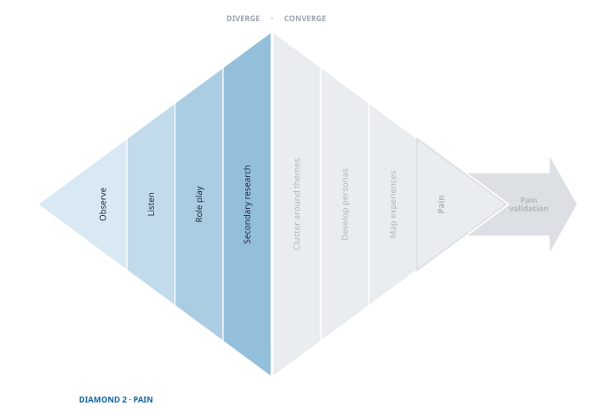

## Unearthing Unmet Needs

{fig-align="center"}
You have a community you can reach. Now you go and learn how they actually live.

The work of this chapter is **ethnographic**: you learn about people by spending time among them rather than by asking them to report on themselves. That distinction does more work than it looks like it should. Ask someone what is hard about their week and you get a considered answer about what they believe is hard. Sit beside them on a Tuesday and you see the thing they stopped noticing years ago, which is the thing worth building for.

::: {.column-margin .def-margin}
**Ethnographic** — learning about people by being among them, in their context, rather than by asking them to describe themselves from memory.

**Exploratory experiment** — a deliberate foray into someone's world undertaken *without* a hypothesis, run to find out what you did not know to ask about.
:::

Each foray is an **exploratory experiment**: deliberate, planned, and run without a hypothesis, because a hypothesis at this stage would only tell you what you already suspect. You are not collecting anecdotes. You are gathering, on purpose, until you have enough raw material that an explanation can be reasoned out of it.

<!-- As you work, the goal is to collect enough raw evidence to ground abductive sense-making, theme finding, persona building, and experience mapping. -->
The evidence comes from two directions, and you need both.

::: {.column-margin .def-margin}
**Primary research** — evidence you gather yourself, first-hand, from people. Conversation, observation, role play.

**Secondary research** — evidence someone else already gathered and published. Reports, statistics, filings, reviews, studies.
:::

**Primary research** is what you collect yourself, in person: the conversations, the watching, the sitting-beside. It is the only source of anything nobody has written down yet, which is where unmet needs live. **Secondary research** is what somebody else already gathered and published. It is faster, cheaper, and cannot surprise you. Its job is to stop you spending three weeks in the field rediscovering something a trade association published in 2019.

This is the essence of ethnographic exploration. We may go in expecting one kind of problem, but if we stay curious and follow emotion, we uncover pains hidden in plain sight. The methods that follow (conversation as guided storytelling, observation and shadowing in context, and role play as embodied empathy) are the tools for creating these moments of discovery. Alongside them, secondary research broadens and triangulates what you learn in the field so you avoid spending time re-learning what is already known.  

As long as new stories keep surprising you, keep exploring. When new data starts repeating what you already know, you’ve reached the edge of your current map. That’s the moment to shift from divergence into abductive synthesis and begin the converge work of themes, personas, and experience maps.

## Finding and Engaging Your People

Now that you’ve selected your community and confirmed access in principle, the next challenge is practical: where do these people actually gather, and how do you engage them in a way that leads to real exploration? You are still testing access, as you did at the end of the first diamond, but now for a different purpose: finding which channels, places, and approaches reliably put you inside their world so you can run ethnographic, exploratory experiments (conversation, observation, shadowing, role play) that build your mountain of data.

### Show Up Where They Are

Begin with the day in the life. Where does this community physically end up, and when? Worksites, clinics, gyms, trade counters, meetups, service desks, transit hubs. What you are looking for is density and dwell time *together*. A pharmacy counter has plenty of people and nobody stays; a dialysis waiting room has both, which is why you can learn something there.

Before you approach anyone, watch. Ten or fifteen minutes of standing quietly tells you the rhythm of a place: when it is frantic, when it lulls, who is waiting and who is working. Enter at a lull. You will also leave with a list of visible frustrations and workarounds to probe later, which is worth the quarter hour by itself.

Most places have someone who controls the door, whether that is a manager, a front-desk clerk, or the person everyone defers to without a title. Find them first and ask plainly: who you are, what you are trying to learn, how long it takes, and what the people you talk to get out of it. A gatekeeper who understands the ask will often introduce you to better participants than you would have found alone. One who is surprised by you will spend the rest of the day protecting people from you.

Make the first ask small. *I'm studying how this gets done here — could I ask you two questions now, or find fifteen minutes later?* Two questions is a request almost anyone can grant, and granting it makes the next request easier. Then, if the conversation goes anywhere, ask for the bigger thing while the goodwill is warm: shadow a task, watch a handoff, look at the forms they fill in. That is where the real evidence is.

Leave a way back. Contact details, a sentence about what you are doing, and a concrete next step arranged before you walk out. Rapport does not survive a week of silence.

### Engage Where They Gather Online

The same shape applies, with one problem of its own.

Finding the rooms is easy: forums, subreddits, Discord and Slack groups, professional associations, niche platforms built around a craft or a role. Judging whether a room is *alive* matters more than finding it. Skim the last fifty posts. You will learn whether there is real discussion or only link-dropping, whether moderation is active, and (as a bonus you did not ask for) what these people complain about when nobody is studying them.

Then you have to introduce yourself, and there is a choice here worth taking seriously. You can say what you are: a student, a founder, someone trying to understand this problem. Or you can simply participate as a member of the community and let the conversation come to you.

Teams reach for the second because the first feels like it will get them ignored. Be careful with it. If you belong to the community, saying so is honest and often an advantage. What is not honest is *concealing why you are there* — asking questions as a peer while collecting evidence as a researcher. People who discover that do not merely stop answering you; they tell the group, and you lose the room for good. The instinct that this feels wrong is a reliable one. Follow it.

The honest version costs less than you think. Say what you are exploring, who you would like to hear from, how much time you are asking for, and what they get back: a summary of what you learn is usually enough. Do not sell, and do not hint at a solution.

After that, keep it light. A one-question poll, or a *last time* prompt — *what was the last time this really got in your way?* — invites a story without demanding a commitment. When someone answers at length, move the conversation somewhere private and give them options for when.

One thing to avoid on both sides of this: do not build your sample out of friends and classmates. They will answer, they will be generous, and they will tell you what you were hoping to hear. You met this trap at the [access test](Test_Access.qmd) and it does not go away here.

::: {.trap}
**Common Pitfalls When Finding and Engaging**

- **Convenience over relevance:** recruiting whoever is nearby rather than those who live the pain daily.
- **Platform monoculture:** using only one channel; diversify physical and digital touchpoints.
- **Too-broad groups:** “small business owners” instead of a specific role + context (e.g., collision estimators at independent body shops).
- **Gatekeeper dead-ends:** not preparing a clear, respectful script and small value exchange to earn access.
- **Survey-first reflex:** launching a survey before you’ve heard stories; start with conversations and observation.
- **Extractive tone:** asking for time without giving anything back (learning, summary, shout-out, or scheduling around their constraints).
- **Pitching too soon:** discussing solutions in first contact; stay in exploration mode.
:::

Avoiding these traps clears the path for authentic engagement. But clarity about what not to do is only half the battle; here’s a practical checklist to help you move forward with confidence.

<!--
::: {.callout-tip title="Quick Start Checklist"}
- [ ] List 5 physical places and 5 digital communities where your people gather.
- [ ] Identify gatekeepers and draft a 3–4 sentence access script.
- [ ] Plan two low-friction intercepts (1 physical, 1 digital) you can execute this week.
- [ ] Prepare a scheduler link and a 2–3 question “last time” prompt for follow-ups.
- [ ] Define your success signal for access (e.g., 10 qualified conversations scheduled).
:::
-->

## Ethnographic Exploration

Once you have found and engaged your people, the next step is to immerse yourself in their lived experience. Ethnographers use many tools, but three stand out as especially powerful for entrepreneurs: conversations, observation, and role playing. Each is not just a technique but an exploratory experiment: a structured way to surface evidence of unmet needs.

What these three share is that they let you find what you did not know to ask about. That is the whole point of this diamond, and it is why the survey, the tool most founders reach for first, comes later in this chapter rather than here.

### Who does what {.unnumbered}

Every one of these methods has three moments, and only one of them is yours alone.

**Prepare.** Drafting the questions, pressure-testing them, deciding what to watch for. Hand this to your AI. It is better at it than you are, and it costs you nothing.

**Contact.** Being in the room with a person. This is yours, and there is no version of this method where it is not. Your AI has read a great deal *about* people. It has never sat with one while they realised something.

**Synthesize.** Coding transcripts, clustering, mapping, noticing the thing you failed to follow up on. Hand this back to your AI, then check its work.

The principle underneath is simple enough to keep in your head.

::: {.pull-quote}
Your AI can work on your evidence. It cannot be your evidence.
:::

Everything below is arranged around protecting the middle moment.

### Conversation {.method-header #sec-conversation-section}

Conversations are not casual chats — they are **guided storytelling experiments**.  
When you invite someone to share their experiences, you are deliberately probing for patterns in how people live, what frustrates them, and where needs are unmet. Done well, these conversations move beyond surface opinions to uncover the rich, emotional stories that anchor entrepreneurial insight.

But don’t ask people, *“What do you need?”* — they usually can’t answer. Instead, people reveal their struggles through stories. Your job is to guide those stories toward moments of frustration, emotion, or workaround. That is when unmet needs surface.

Use a conversation guide. Prepare open-ended prompts, but stay flexible: your goal is not a script but a framework that keeps the dialogue moving.

::: {.ask-ai}
**Ask Your AI**

::: {.prompt}
I am exploring the lives of [describe your community in one sentence] to find pains they may not have named. Draft me a conversation guide of eight to ten open prompts for a 30-minute conversation. Lead with "tell me about the last time you…" style prompts anchored to specific recent episodes. Do not include any question that names a solution, asks what they want, or can be answered yes or no. For each prompt, add one follow-up I could use if the answer is short.
:::
:::

::: {.checkpoint}
**Check before you use it**

Your AI drafted a guide from a description you wrote. Both of you may be wrong about these people, and that is the point of going. Before you take it into the field:

- **Strike any prompt that names a solution.** If a question could only be answered by someone who already agrees with you about what the problem is, it will get you agreement rather than evidence.
- **Find the leading ones.** "How frustrating is it when…" tells the person what to feel. "Tell me about the last time…" does not.
- **Keep at least two prompts you would not have thought to ask.** If the whole guide reflects what you already believe, you have automated your assumptions.
:::

#### How to run the experiment (short form)

1. Prepare a light interview protocol: a few “last time” prompts, not a long script.  
2. Meet people in their context (kitchen, workshop, office, shop floor).  
3. Encourage storytelling: “Tell me about the last time you…”  
4. Listen for emotional spikes: frustration, embarrassment, delight.  
5. Probe gently: “What made that difficult?” “What did you do next?”  
6. Capture notes and stories; debrief with your team immediately after.  

*Success measure*: when people forget they are being “interviewed” and simply tell you their story, you are doing it right.

<!--
#### Worked Example: Halo Alert
While exploring safety in senior living facilities, the Halo Alert team interviewed staff about emergency response systems. At first, staff talked about the equipment itself. But when prompted for stories, one nurse shared her fear when a pendant button didn’t transmit during a nighttime fall. That emotional spike — fear of failure at a critical moment — revealed a deeper pain than “buttons are old.” The team realized they were dealing with trust in life-and-death reliability, not just product usability.
-->

::: {.for-curious}

For the Curious — How many interviews do we need?

There’s no fixed number. Early on, every conversation reveals new stories. Keep going until stories begin to repeat and new interviews add little that’s novel. That’s your signal to pause and move into convergence.

Expect to hear more than one recurring story, and do not read that as a problem. Most communities carry several pains at once, and choosing among them is the work of the next chapter.

What you are watching for is something narrower: whether the stories sort by *person*. If the same people report all three, you have one group with three pains, and you will prioritise. If each story belongs to a different kind of person — the ones who work nights, the ones without a car, the ones new to the role — then the label you started with is covering several communities, and you will narrow to one before you can validate anything.

That distinction matters most to teams who chose an ambitious group, because breadth delays the whole signal. The wider the label, the more conversations you need before anything repeats at all, and the more likely the repetition sorts by person when it finally arrives.

:::

**Toolkit Resource**  
See the [Conversation Guide](toolkit/Conversation_Guide.qmd) for a ready-to-use protocol, sample prompts, and a notes template.

---

### Observation {.method-header #sec-observation-section}

Observation is not passive watching — it is an **experiment in context**.  
Sometimes the most powerful insights come not from what people say, but from what they do. By placing yourself where people live, work, or struggle, you see routines, interactions, and workarounds unfold in their natural setting. Done well, observation reveals unspoken needs and patterns that conversations often miss.

Look for moments of friction. When people improvise, complain under their breath, or devise a workaround, they are revealing unmet needs in action.

::: {.mini-case}
**Find Opportunity in Frustration**

One innovation team thought they understood the pain in auto body repair. Customers hated long delays and unpredictable updates while their cars were in the shop. The problem seemed obvious: fix customer communications.

Then they spent time inside a repair shop. While waiting in the office, a burst of shouting echoed from down the hall. Instead of ignoring it, they followed the sound and found a technician furious at the tedious process of moving information back and forth with insurance adjusters. Estimates had to be re-typed into one system, then again into another, with errors compounding at each step.

In that moment, the team realized the real bottleneck wasn’t customers waiting for news—it was employees drowning in broken data flows. By listening for emotion and tracing frustration to its source, they uncovered a more valuable, systemic pain: the brittle exchange of information between insurers and shops.
:::

#### How to run the experiment (short form)

- Choose a setting where your community naturally gathers (gym, café, clinic, workplace, trade counter, online forum).  
- Blend in: be present without becoming the center of attention.  
- Take **structured notes** on behaviors, contexts, and interactions before interpreting them:

    1. *What are they doing?* (observable facts)  
    2. *How are they doing it?* (effort, workarounds, emotion)  
    3. *Why this way?* (informed guesses about motives and constraints)  
    4. *What are they interacting with?* (people, tools, systems, spaces)  
    5. *What is absent?* (who is missing, which steps are skipped, or what resources are absent)  

- Watch for workarounds, repeated frustrations, hesitations, delays, and the subtle rituals that hint at unmet needs.  

*Success measure*: when you can describe how a day actually unfolds for your community, not just what they say about it.

<!-- 
#### Worked Example: Halo Alert
One team shadowed older adults at a senior center. They noticed many wore personal medical devices but hesitated to press emergency buttons in social situations. This insight — **observed, not declared** — suggested a need for safety technology that avoids stigma. -->

::: {.for-curious}

For the Curious — How do I start observing without it being awkward?

Enter through a natural artifact or activity. For example, a Shakespeare reading group brings seniors together around the play, but the real learning comes from the informal conversations and behaviors that follow. Anchor yourself in the activity; the observation will flow naturally.

:::

**Toolkit Resource**  
See the [Observation Guide](toolkit/Observation_Guide.qmd) for a ready-to-use guide on how to observe and how to record your observations.

<!-- 
 -->

---

### Role Playing  {.method-header #sec-role-play-section}

Role playing is not theater for its own sake — it is an **experiment in simulation**.  
By enacting real or imagined scenarios, you and your participants surface hidden reactions, tacit knowledge, and unspoken assumptions. Role play creates a safe space to test how people might behave in situations that are rare, risky, or difficult to observe directly.

Use role playing to reveal what people cannot easily articulate. It often exposes emotional responses, social dynamics, and decision shortcuts that surveys or conversations miss.

#### When to use role playing

- To simulate situations that are hard to observe in the wild (e.g., emergencies, negotiations).  
- To uncover emotional reactions or group dynamics around a scenario.  
- To test prototypes or service concepts in a “lived” context before building them.  

#### Design principles

- Ground the scenario in realistic detail (context, roles, stakes).  
- Encourage participants to stay “in character” but debrief afterwards.  
- Observe both behavior and language, especially moments of tension or improvisation.  
- Keep the setup simple so the focus stays on people, not props.  

*Success measure*: When role play reveals responses, workarounds, or tensions that people themselves did not realize they carried, the experiment has done its job.  

::: {.mini-case}
**Patty Moore, in someone else's body**

Designer Patty Moore once simulated aging by wearing a body brace, earplugs, blurred glasses, and a wig over months of immersion. She discovered not only the physical difficulty of opening pill bottles and boarding buses, but the social reality of how differently others treated her.^[Patnaik [-@patnaikWiredCareHow2009] tells this story in *Wired to Care* to illustrate how designers can create deep empathy through embodied simulation.]  
:::

**Toolkit Resource**  
See the [Role Play Guide](toolkit/Role_Play_Guide.qmd) for a ready-to-use guide on how to setup, run, and interpret a role playing experiment.

---

### A Note on Surveys — Not an Exploratory Tool {#sec-surveys-section}

Surveys are the tool most founders reach for first, and this diamond is the wrong place for them.

A respondent can only answer the question you thought to ask. That is fine when you already know what you are looking for — and fatal when you don't. The needs worth building on are the ones your people have stopped noticing: the workaround so old it feels like the weather, the anxiety they would never call a problem. No one writes a survey item for a need nobody has named yet, least of all the person living with it.

Occasionally a survey does explore, when respondents happen to be unusually willing to type at length and you have left them room to. It happens. It cannot be relied on, and you should not design your exploration around the hope of it.

So surveys are held for later, where they are genuinely strong: *once a hypothesis is clear*, a survey measures how widespread a pain is, compares subgroups, and ranks what matters most. That work belongs to [Validate Customer Pain](Validate_Pain.qmd), and the guidance below is here so it is at hand when you get there.

::: {.trap}
**The Survey-First Reflex**

It is one of the most common ways an exploration fails: it produces a great deal of data about the questions you already had, and none about the ones you didn't.
:::

#### When to use surveys

- To validate and rank insights gained from conversations and observation.  
- To measure how widespread frustrations are across a population.  
- To gather input from communities you cannot easily observe or interview.  

#### Design principles

- Use open-ended prompts sparingly but strategically (e.g., “What is the hardest part of X?”).  
- Include ranking or rating scales to gauge relative importance.  
- Pilot-test questions to catch bias or ambiguity.  
- Keep them short and focused; long surveys rarely yield thoughtful responses.  

*Success measure*: When your survey sharpens which pains matter most and how widespread they are, the experiment has done its job.  

**Toolkit Resource**  
See the [Survey Guide](toolkit/Survey_Guide.qmd) for a ready-to-use guide on survey design principles and traps to avoid.

---

<!-- 
 -->

Together, these three exploratory experiments (conversations, observation, and role playing) build the mountain of data you need. Each generates a different kind of evidence, but all share a common purpose: uncovering unmet needs that remain invisible until you engage, watch, and feel your way into them. Alongside them sits secondary research, which gathers what is already known so you don't spend field time rediscovering it. Between them they build the mountain of data you need.

## Archival and Secondary Research Experiments  {#sec-secondary-research-section}

Not every insight comes from fieldwork. Much is already known, sitting in industry reports, government statistics, academic studies, and trade publications. Secondary research is your way of running exploratory experiments with data others have already collected. Each probe into an archive or database is a test: *“What does this source reveal, and how does it align with or challenge what I’ve seen in the field?”*

::: {.pull-quote}
If it is already known, don’t rediscover it through interviews or observation.
:::

Mine existing knowledge so you can focus your primary exploration on what is still unknown.

### What Secondary Research Contributes

- **Customer insights**: demographics, preferences, usage patterns, and emerging behaviors.  
- **Market analysis**: product landscapes, market shares, and total addressable market.  
- **Competitor analysis**: who else is addressing your space, and how.  
- **Industry trends**: technological shifts, regulatory moves, cultural currents.  

Secondary research rarely reveals unmet needs directly. But combined with ethnographic exploration, it frames the opportunity landscape and sharpens your hypotheses.^[@ethingtonPrimaryVsSecondary2018 notes that while no single source can answer the entrepreneur’s core questions, triangulating across multiple studies helps reveal where unmet needs are most likely to emerge.]

### Hand This One Over

Of everything in this diamond, secondary research is the work most worth delegating. The input is documents, not people. Your AI reads faster than you, never gets bored on page forty of an industry report, and has no stake in what it finds.

::: {.ask-ai}
**Ask Your AI**

::: {.prompt}
I am researching [describe your community and the problem space]. Search for what is already documented about how these people live and where they struggle: government and public data, industry and trade press, academic work, market and competitor reports. For each finding, give me the specific source and a link. Separate what is well established from what is contested or thin. Then tell me the two or three things I would most expect to be documented that you could not find, because those gaps are where I should be spending my own time.
:::
:::

That last instruction is the important one. What is missing from the record is a better lead than what is in it: an absence often means nobody has looked, and nobody looking is what neglect looks like from a distance.

::: {.checkpoint}
**Check before you believe it**

This is the one place in the book where handing work to an AI carries a real risk of being confidently wrong, because plausible-sounding sources are exactly what a language model is good at producing.

- **Open every source you intend to rely on.** Not the summary. The source. If you cannot find it, it does not exist, and you have just been saved from citing it.
- **Check the date and the population.** A 2015 figure about a different country is not evidence about your people, however relevant it sounds.
- **Write down which claims you are now treating as settled**, because you will stop testing those in the field. That list should be short, and everything on it should have a link you have clicked.
:::

Some useful starting points if you want to look yourself: [USA.gov](https://www.usa.gov/statistics) and the [US Census](https://www.census.gov) for public data, [Google Trends](https://trends.google.com/trends/) for what people are searching and when, and [Gapminder](https://www.gapminder.org/) for global demographic and social indicators.

### Where to Look That Costs Nothing

The expensive databases get the attention, and you do not need them. Almost everything an entrepreneur wants is public, once you recognise that it counts as evidence:

- **What competitors say about themselves** — press releases, product launches, pricing pages, SEC filings, industry newsletters.
- **What their customers say when nobody is asking** — Amazon, Yelp and G2 reviews, Reddit threads, support forums, Glassdoor. The closest thing to overhearing your market.
- **Where the money and effort are going** — job postings on LinkedIn and Indeed show what firms are staffing up to do; patent filings at the USPTO show what they think is worth protecting; Crunchbase and funding news show who else has noticed.
- **The rules of the game** — regulatory filings with the FCC, FDA or SEC, analyst reports, trade association updates, adjacent industry news.

The second of those is the one teams under-use. A thousand one-star reviews of the nearest existing product is a corpus of people describing, unprompted and at length, exactly how it fails them.

::: {.key-action}
**How to Use Secondary Research Effectively**

1. **Start with it** — scan existing knowledge before entering the field, so your primary research targets what isn’t already known.  
2. **Use it to triangulate** — compare published findings with what you hear and see in context.  
3. **Treat it as experiment design** — each search is a probe: *“If I look here, what will I learn?”*  
4. **Document both findings and absences** — what you expected but didn’t find can be a clue.  
:::

**Toolkit Resource**  
See the [Secondary Research Guide](toolkit/Secondary_Research_Guide.qmd) for a ready-to-use guide on what information to seek and where to look.

---

In short, archival and secondary research experiments widen your vision. They prevent reinventing knowledge, situate your field insights in broader context, and strengthen confidence that the pains you uncover are real, significant, and shaped by larger trends.

At some point, though, both fieldwork and desk research begin to repeat themselves. The real question becomes: when is the mountain of data high enough? That’s where the principle of “enough is enough” comes in.

---

## When Enough Is Enough

Exploration can feel endless. There is always another person you could interview, another setting to observe, or another report to read. But at some point, the return on effort drops. The signal to stop is not exhaustion or impatience.  It is the decline of **information entropy** that is your signal to stop gathering and move into abductive hypothesizing (sense-making).^[The concept of information entropy comes from Claude Shannon’s work in communication theory [@shannonMathematicalTheoryCommunication1948].]

::: {.column-margin .def-margin}
**Information entropy** — the rate of newness in what you are learning. High when every conversation brings a surprise; low when they start echoing each other.
:::

At the beginning, every conversation, observation, or article adds something novel. Over time, surprises become rarer, and new inputs mostly echo what you have already heard or read. This flattening of novelty is your cue: the mountain of data is high enough. You are no longer climbing higher, just circling the same slope.

::: {.learn-ai}
**Learn From Your AI**

::: {.prompt}
Teach me what information entropy means and why a drop in it is a signal to stop gathering data. Use an everyday example rather than the mathematics, then show me how the same idea applies to a founder deciding whether to run more customer interviews.
:::
:::

Stopping does not mean you know everything. It means you have reached the point where you know enough about your people to generate *informed* hypotheses about their needs.

::: {.checkpoint}
**Check before you stop**

Deciding you have enough is the easiest decision in this book to get wrong, because stopping is what you want to do anyway. Ask your AI to read across everything you have gathered and tell you where the novelty actually stands. Then check its answer against three things it cannot know:

- **Name the last thing that genuinely surprised you, and when it happened.** If you have to reach back more than a few conversations, the curve really has flattened. If you cannot name one at all, you may never have been surprised, which is a different and worse problem.
- **Check who you have not talked to.** Novelty flattens quickly if everyone you reached came through the same door. Repetition across one channel is not saturation.
- **Ask whether you stopped hearing new things or stopped asking new questions.** These feel identical from the inside.

If most new conversations yield no fresh themes, if further observation only confirms what you have, and if the reports repeat each other, and none of the three checks above raises a flag, stop.
:::

Entrepreneurs often struggle here. Quitting too early risks thin data and shaky insights. Quitting too late risks delay and wasted effort. But when novelty fades, and repetition dominates, the exploration phase has done its work. It is time to move from gathering to reasoning, from raw discovery to shaping hypotheses that can be tested.

---

In short, the goal of exploratory experiments, whether in the field or in the archives, is not to collect every possible fact but to reach the point where additional data stops changing the picture. At that moment, you are ready to shift from divergence into convergence and move toward isolating the pains that matter most.

## The Essence of Exploratory Research

Exploratory research is not about confirming what you already know; it is about broadening your field of vision. Its essence is curiosity: stepping into conversations, watching behavior in context, simulating lived experience, and mining what is already known in archives and reports. Each method, whether an interview, an observation, a role play, or a scan of existing data, is an exploratory experiment designed to surface unmet needs that would otherwise remain invisible.

What matters most is not mastering every method, but assembling a diverse stream of evidence. Stories, observed workarounds, simulated frustrations, and statistical trends each illuminate the problem space from a different angle. Taken together, they create a textured picture of people’s lives and the opportunities within them.

But exploration cannot be endless. The true art lies in knowing when the mountain of data is high enough: when novelty begins to fade, and it is time to shift from gathering to sense-making. Exploratory research gives you raw material; abductive reasoning and analysis turn that material into insight.

In short: the essence of exploratory research is open-ended curiosity, disciplined variety, and the judgment to stop collecting when learning plateaus. With that balance, you are prepared to move from exploration toward convergence and the identification of your most urgent unknown.

