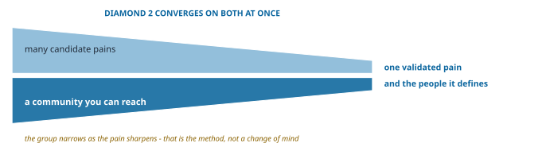

## Why Pain Comes Second {.unnumbered}

Most startup methods begin with an *idea* and then test whether anyone cares. Expeditionary innovation flips that order. We begin with people, because you can’t uncover meaningful problems without being anchored in a real community. Only then do we move to the second diamond: surfacing the pain those people actually live with.

This matters because most needs aren’t obvious. People adapt. They normalize friction, create workarounds, and stop noticing how much effort or anxiety a “normal” day demands. If you ask directly, you’ll often hear *“it’s fine”*, even when it isn’t. The work of this diamond is to uncover those hidden frictions, name them clearly, and turn them into hypotheses you can test.

{#fig-pain-diamond-3 fig-align="center"}

## Two Things Narrow at Once {.unnumbered}

The first diamond left you with a community you can reach. It did not leave you with your customers, because customers are defined by what they share, and you do not yet know what these people share.

That is what this diamond settles, and it settles two things at the same time. As the pain comes into focus, **the people come into focus with it**. You arrive holding a broad community and a long list of candidate frictions. You leave holding one validated pain and the group that actually carries it, which is almost always narrower than the group you started with.

{#fig-reconvergence fig-align="center"}

This is worth expecting, because it is easy to misread. When your early conversations split into two or three different stories rather than one, the instinct is to conclude that you chose the wrong people. Usually you chose a group that contains several. The work is not to start over. It is to notice which story keeps returning, and to let that story tell you who your people are.

Only at the end of this diamond have you earned the phrase **your people**: not everyone you have been talking to, but the ones a shared pain defines.

## The Pattern: Diverge, Converge, Test {.unnumbered}

As with every diamond, the rhythm is diverge → converge → test.

- **Diverge**: *Build a mountain of data.* Through *conversations*, *observations*, and *role play*, together with *secondary research* to gather what is already known, you build up raw material. The aim isn’t validation; it’s abundance. You want messy, overlapping stories and signals you can later sort.
- **Converge**: *Turn signals into hypotheses*. Using *empathy analysis tools* (clustering notes, developing personas, mapping experiences) you begin to see patterns. From these, you form *hypotheses of pain*: testable statements about unmet needs that feel urgent and consequential.
- **Test**: *Validate the pain*. Through pain validation experiments (the pain validation protocol, the ouch factor test, willingness-to-pay probes) you check whether these hypothesized needs are real, frequent, and strong enough that people lean in when you bring them up.

Each stage has its own tools, guides, and demos. Together, they move you from *noise* to *signal*: from thousands of words and fragments in your field notes to a short list of validated pain statements that can anchor solution design.

## Why This Stage Is Critical {.unnumbered}

If you skip pain discovery and jump straight to solutions, you risk solving the wrong problem, or a problem too shallow to matter. That’s why this diamond is second, not last. The people you chose in Diamond 1 will keep you anchored, but it is the pain you surface here that ensures your eventual solution is worth building.

This work is both empathetic and analytical. It demands curiosity to see the hidden burdens of daily life, and discipline to reduce the mess into clear, falsifiable statements. When you get it right, you create the single greatest lever in entrepreneurship: a validated problem that customers are already waiting to have solved.

---

::: callout-note
**How to Use This Diamond**  
Pair each chapter with its companion tools and demos:  

- Narrative chapters explain the *why* and *what*.  
- Guides in the Toolkit show you *how*.  
- Halo Alert demos show the *real application*: unfiltered notes, transcripts, and synthesis from the field.  

Together, these resources give you both the reasoning and the practice to hypothesize customer pain with confidence.
:::
