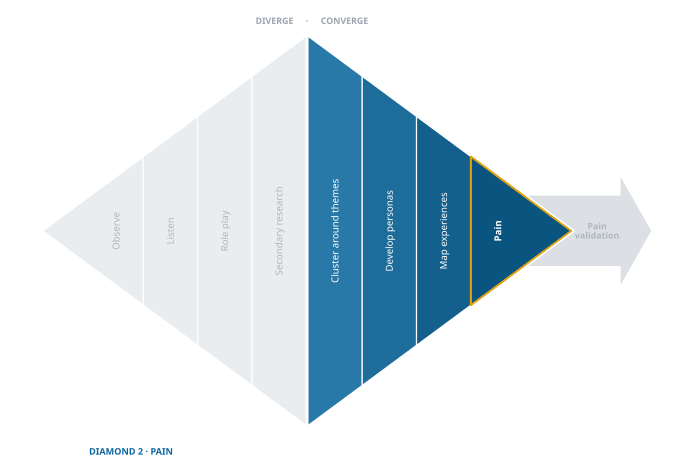

## Converging from Exploration to Unmet Needs
<!-- ## Integrating Empathy and Abduction to Define Unmet Needs -->

<!--  --> 
{fig-align="center"}
When the exploration surprises slow down, it’s time to change gears. You’ve built a mountain of raw notes, quotes, and observations. Now comes the meaningful part: making sense of it. Exploration gives you raw material; convergence turns that material into insight.  

This is where **empathy and abduction work together.** Empathy helps you see the world through your people’s eyes. Abduction helps you turn that empathy into *plausible hypotheses of hidden pain*. Together, they stop you from settling for the obvious needs that everyone else already sees. They help you discover the deeper, less visible pains that others miss — the ones that unlock opportunity.  

## Why Empathy Tools Matter  

Most entrepreneurs want to skip straight from interviews to solutions. That’s a mistake. Without tools for empathy, you’ll latch onto surface problems — things customers will happily tell anyone. But those aren’t where the advantage lies.  

To find deep unmet pains, you need to **organize, reframe, and visualize the messy data you’ve collected.** That’s what empathy tools are for. They force you to slow down and *see patterns you would otherwise miss*.  

Here are the three we’ll use:  

1. **Clustering into Themes** – Sorting dozens of fragments into coherent groups so repetition and patterns start to emerge.  
2. **Personas** – Creating vivid, representative characters who embody those patterns, so you can imagine their world more concretely.  
3. **Experience Mapping** – Tracing those personas through a real journey, stage by stage, to spot the friction, stress, or anxiety points where unmet pains live.  

These tools don’t replace your data. They *reveal what’s hidden inside it*.  

### Clustering into Themes {#sec-cluster-themes-section}

The first step in making sense of messy data is clustering. After exploration, you’re left with dozens (maybe hundreds) of raw notes, quotes, and observations. On their own, they feel scattered and overwhelming. Clustering brings order. It’s the moment when fragments begin to take shape as patterns.  

The process is simple but powerful: spread your notes out and start grouping them wherever you see connections. At first it feels random — one quote next to another, a story placed beside a statistic — but as you continue, themes begin to emerge. What looked like chaos turns into clusters of experience that share a common thread.  

This is often the first “aha” moment in convergence. The repetition that felt boring during fieldwork now becomes signal. When you notice three, five, ten different notes pointing to the same kind of frustration, you realize: *this is not just one person’s problem. It’s a pattern.*  

Clustering doesn’t solve the puzzle by itself, but it clears the fog. It turns a mountain of disconnected pieces into a landscape where hills and valleys start to appear. From here, you can move on to personas and experience maps with a clearer sense of direction.  

::: {.callout-note  title="See the Demo"}
In the [Halo Alert demo of clustering into themes](demo/exp-06-cluster-themes-2025-03-12.qmd), you’ll see how dozens of raw quotes and notes from interviews were clustered into themes about safety during evening commutes. Watch how the noise of scattered observations turns into patterns you can actually work with.  
:::  

### Developing Personas {#sec-persona-section}

Once you’ve clustered your data into themes, the next step is to give those themes a face. That’s what a persona does. A persona is a fictional character built from real evidence — a stand-in that captures the shared experiences of a group you studied.  

Why bother? Because it’s hard to empathize with “a cluster of notes.” It’s much easier to imagine the daily life of *Maya, a 27-year-old attorney who walks between the subway and her office and feels a knot of anxiety on dark streets.* Personas take abstract patterns and make them human again. They help you imagine how a real person thinks, feels, and acts when they bump into unmet needs.  

A persona doesn’t have to be perfect or permanent. It’s a working tool, a way of focusing your empathy. The key is that it represents more than demographics. A good persona doesn’t just say “young women, ages 18–24.” It highlights the specific pains and contexts that matter: the late-night walk, the texting family members, the constant low-grade worry.  

As you continue, your personas will evolve. Early on, they may feel rough or even a little clichéd. That’s okay. The act of building them forces you to stay grounded in the lived experiences of your people instead of drifting back into generic assumptions.  

::: {.callout-note  title="See the Demo"}
The [Halo Alert demo of developing personas](demo/exp-07.a-persona-2025-03-12.qmd) shows how themes can be personified in a vivid persona — Maya Patel. Maya is an archetypal composite built from more than a hundred conversations with professional women who walk as part of their commute— a living character who makes the patterns concrete.  
:::  

### Experience Mapping {#sec-experience-map-section}

If clustering shows you the patterns and personas put a face to them, then experience mapping lets walk alongside that person through their day. An experience map (sometimes called a journey map) traces the steps your persona takes as they try to reach a goal — commuting home, managing health, buying supplies, anything that matters in their life.  
At each stage you ask: what are they doing? what are they thinking? what are they feeling? The feelings are especially important. Frustration, anxiety, embarrassment, relief — these are often the clues that point to unmet needs hiding beneath the surface.  

Experience mapping isn’t about designing solutions yet. It’s about slowing down enough to notice where the bumps really are. Often, entrepreneurs are surprised to find that the most painful points are not at the beginning or the end of the journey, but in small, in-between moments where stress or friction builds up.  

The value of experience mapping is perspective. It takes the fragments from your clusters and the personality of your persona and strings them into a story you can analyze. When you see a journey laid out stage by stage, you’re better able to spot where intervention might matter most.  

::: {.callout-tip  title="Converge Without Collapsing"}
Convergence reduces chaos, but it doesn’t mean collapsing into one neat artifact. You may still need several personas — and multiple experience maps. And each map can surface **multiple candidate pains.**  

Choose the most urgent pain to test, but don’t discard the rest. Keep them in the *refrigerator* so you can revisit them if surprises arise during testing or solution design.  
:::  

::: {.callout-note  title="See the Demo"}
In the [Halo Alert demo of experience mapping](demo/exp-08.a-experience-map-2025-03-14.qmd), Maya’s journey commuting from work to home is mapped stage by stage. The map shows where her anxiety spikes and how her family becomes involved in the stress — surfacing multiple candidate pains to explore further.  
:::  

## Abduction  {#sec-abduction-section}

<!-- Make the Leap from Insights to a Hypothesis --> 

Once you’ve clustered themes, built personas, and mapped experiences, you’ll start to see patterns of stress and friction. But spotting patterns isn’t enough. You still have to make the leap: *what hidden pain best explains what I’m seeing?* That’s the work of abduction.  

Abduction is educated guessing. Unlike deduction (which proves from rules) or induction (which generalizes from data), abduction asks: *what’s the most plausible explanation for this odd fact, repeated frustration, or emotional spike?* It’s the reasoning we use every day — when the car won’t start and we say, “maybe the battery’s dead,” or when a friend is unusually quiet and we wonder, “maybe something happened at work.” In entrepreneurship, abduction is how you turn empathy insights into pain hypotheses you can actually test.  

Here’s how to do it:  

1. **Start with the evidence.** Go back to the clusters, the persona’s story, the experience map. Look especially at emotional highs and lows, because strong feelings often signal deeper unmet needs.  
2. **Generate multiple possible explanations.** Don’t stop at the first idea. For every observed frustration, ask, *what pain could be causing this?* Write down several options.  
3. **Check for alignment.** Does the hypothesized pain make sense given what you know about the community? Does it match what people actually said and did?  
4. **Refine and prioritize.** Eliminate the weak or far-fetched explanations. Sharpen the promising ones until they’re clear, specific, and testable.  
5. **Select the most plausible hypothesis.** Choose the pain statement that best explains the evidence and feels most urgent in the lived experience of your people.  

Good abduction is active, not passive. It’s not waiting for the right pain to reveal itself — it’s drafting, comparing, and revising until you land on the most plausible hypothesis.  

::: {.callout-note  title="See the Demo"}  
The [Halo Alert demo of hypothesizing pain](demo/exp-09-hypothesize-pain-2025-03-16.qmd) takes those candidate pains and runs them through abductive reasoning: drafting, comparing, and refining until one pain hypothesis stands out as most urgent and testable.  
:::  

## What Makes a Good Pain Hypothesis {#sec-hypothesize-pain-section}

It’s tempting to say, “The problem is X, so that’s the pain.” But problems and pains are not the same thing.  

- A **problem** is the gap between the way things are and the way they should be.  
- A **pain** is the *personal cost* of living with that problem.  

That difference matters. Customers don’t shout “hallelujah!” when you solve a vague problem. They do when you relieve a pain they actually feel. Sometimes you don’t even need to solve the problem completely — you just need to ease the pain enough that people’s lives feel lighter.  

Think of it this way: a problem is abstract, but pain is lived. It’s the frustration, expense, anxiety, or social sting that comes from wrestling with the problem day to day.  

### Five Kinds of Pain  

Most real pains fall into one or more of five buckets:  

1. **Physical** – literal, bodily pain (e.g., discomfort, injury, exhaustion).  
2. **Functional** – extra effort, inefficiency, or lost time in daily activities.  
3. **Financial** – money lost, extra costs, or wasted resources.  
4. **Emotional** – anxiety, frustration, identity challenges, stress.  
5. **Social** – stigma, lost status, awkwardness, or strained relationships.  

Many situations include several at once. Celiac disease, for example, creates all five: physical discomfort, functional hassles around diet, financial costs of gluten-free products, emotional strain of feeling broken, and social awkwardness when eating with friends.  

### The Hallmark of a Good Hypothesis  

A good pain hypothesis is:  

- **Specific.** It names the exact personal cost, not just the problem.  
- **Categorized.** It’s clear which types of pain are in play.  
- **Grounded.** It comes from your empathy work — clusters, personas, maps.  
- **Testable.** You can take it back to people and see if they nod vigorously or shrug.  

::: {.callout-tip title="See the Near-Misses"}
Reading good pain statements is not enough — you will recognise your own concept in one and carry on writing what you were already writing. The [Pain Statement Gallery](toolkit/Pain_Statement_Gallery.qmd) sets weak statements beside stronger ones and names what changed. Most people need the contrast before the distinction becomes usable.
:::

::: {.callout-warning  title = "The Danger of 'Problem Mapping'"}
It’s easy to start with a big, vague problem and then design a clever solution that tackles one corner of it. The catch? If that corner doesn’t touch a *real pain* your people actually feel, customers won’t care.  

This is why so many “problem-driven” startups fizzle. The solution maps neatly back to the problem statement, but not to the lived costs of the people it’s meant to serve. Always check: does this hypothesis connect to a personal pain — physical, functional, financial, emotional, or social — that someone will *thank you* for relieving?  
:::  

### Industrial Abduction

When Gillette entered the Indian market, they didn’t just ship razors designed for American bathrooms. They sat on floors with men who shaved with bowls of water, often without electricity. Through empathy they saw pains others had missed: longer hair from infrequent shaving, no running water, awkward grips. Their abductive leap was the **Gillette Guard** — a lightweight, single-blade razor with a special handle designed for that posture.  

The Guard became a market success. Gillette succeeded not by inventing new technology, but by spotting pains others ignored.  

## Conclusion: Ready to Test  

Exploration gave you breadth. Convergence gives you depth. By now, you’ve moved from **exploration** to **sense-making**:  

- You clustered scattered field notes into clear themes.  
- You gave those themes a human face through personas.  
- You traced their lived journey in experience maps.  
- You practiced **abduction** to generate and sharpen candidate pain hypotheses.  

Now you have a handful of well-formed hypotheses about the pains your people actually live with that feel grounded in evidence rather than guesswork. But they are still **hypotheses** — provisional explanations that could be wrong.  The next step is to test them — to find out which ones are real, urgent, and worth solving.  
<!-- The result is a short list of plausible pains that feel grounded in evidence rather than guesswork. But they are still **hypotheses** — provisional explanations that could be wrong.  -->

That’s why the next step matters. In the final stage of this diamond, we shift from abductive reasoning to **validation testing**. The goal is to find out:  

- Which pains are *real*, not just artifacts of a few stories.  
- Which pains are *frequent*, not rare edge cases.  
- Which pains are *urgent enough* that people lean in when you bring them up.  

This is where conjecture meets evidence again. Just as you began with exploratory experiments, you now design **pain validation experiments**. These will confirm whether your hypothesized pains truly exist, how often they occur, and how much they matter.  

<!-- In the next chapter, we’ll walk through that process: how to design, run, and interpret validation tests so that your final problem statement rests on more than intuition.  -->
