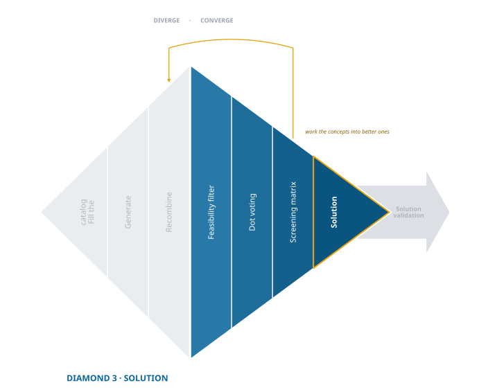

## Evaluating Solutions: From the Many to the Good

<!--  -->
{fig-align="center"}
Successful innovation requires repeated cycling between divergence and convergence. After generating many ideas through ideation, you are faced with the challenging but crucial task of evaluation. This chapter focuses on how to sift through the sea of possibilities to identify those few ideas that truly have the potential to solve customer pain effectively. Remember, the goal is not just to find a good idea, but to find the best one among many. This process of elimination is critical: while it may seem counterintuitive, the path to a great solution often lies in discarding numerous bad ideas, which although not feasible or optimal, play a vital role in leading us to the good ones.

### Idea Evaluation: Comprehensive Assessment Criteria

In evaluating the multitude of ideas generated, it's crucial to consider a range of criteria that go beyond just feasibility. This includes:

-   **Potential Impact:** Assess how significantly each idea could solve the identified customer pain. This involves considering the depth and breadth of the impact on the target market.
-   **Alignment with Customer Pain:** Ensure that each idea closely aligns with and effectively addresses the customer pain points identified during the research phase.
-   **Resource Requirements:** Evaluate the practicality of each idea in terms of resources required --- including time, finances, and skillsets available within the team.

### Selective Refinement:Focusing on High-Potential Ideas

Once a subset of ideas has passed the initial evaluation, they should undergo selective refinement. This involves:

-   Iteratively refining these ideas, incorporating feedback and insights gained from each iteration.
-   Testing these refined ideas in small-scale experiments or prototypes to gather more concrete data on their viability and effectiveness.

### Iterative Approach: Customer-Centric Solution Development {.unnumbered}

#### Continuous Integration of Customer Feedback

-   Maintain a close loop with your target customers, seeking their feedback on the refined ideas.
-   Use customer insights to iteratively develop the solution, ensuring that it evolves in alignment with the customer's evolving needs and preferences.

#### Embracing Speed and Efficiency

-   An iterative approach, while appearing time-consuming, can significantly accelerate the process of finding a viable solution.
-   Iteration allows for quick pivots based on feedback, reducing the risk of pursuing ineffective solutions and ensuring a better fit with market demands.

## Feasibility Filter: The First Line of Defense

The feasibility filter is your first tool in the evaluation phase. It's a straightforward yet powerful way to quickly eliminate ideas that are clearly impractical or impossible to implement. It helps in streamlining the pool of ideas by removing those that fail to meet basic feasibility criteria, such as technological constraints, resource limitations, or fundamental misalignments with customer needs. Review each idea and ask simple yet critical questions: Can this be built within reasonable constraints? Does it align with the customer pain identified? If the answer is no, set it aside. Remember, every idea, even the infeasible ones, has contributed to the creative process and brought you closer to viable solutions.

## Dot Voting: Harnessing Team Passion and Insight

With the obviously infeasible ideas out of the way, focus shifts to those ideas that ignite passion within your team. Dot voting is an effective and democratic way to gauge team enthusiasm and support for different ideas. Spread out all the remaining ideas and give each team member a set number of votes (dots) they can use. Encourage team members to vote for ideas they genuinely believe in and are passionate about solving. This method not only narrows down the list to the most promising ideas but also ensures that the team is collectively invested in the ideas moving forward. Typically, this process will help you condense your list from hundreds to around 10-20 ideas, setting the stage for deeper analysis and refinement.

The tools outlined here are designed to help you move from a broad array of possibilities to a focused set of promising ideas. They are the stepping stones to identifying solutions that not only address the customer pain effectively but also resonate with your team's capabilities and passions. As you proceed through this phase, keep an open mind and remember that the best solutions often emerge from the confluence of feasibility and team conviction.

## Screening Matrix: Filtering for the Best Ideas

A screening matrix is a form of *controlled convergence* to evaluate and separate good ideas from better ideas.[^1] The first step is to construct a decision matrix to rank the solution concepts. The decision matrix comprises market requirements, a reference solution, and the list of remaining solutions.

[^1]: Controlled convergence is a two-stage method to evaluate and separate ideas. The first stage is concept screening and the second stage is concept scoring. In both cases, you will construct a decision matrix to rate and rank your remaining concepts (solution ideas). In this chapter, we will only consider concept screening because, in entrepreneurship, we almost never have enough information about customers and their requirements to determine the weights for scoring. To see concept scoring in detail, see @pughTotalDesignIntegrated1991, @ulrichProductDesignDevelopment1995, and @mattsonFundamentalsProductDevelopment2018.

### Construct the Screening Matrix

#### Market Requirements {.unnumbered}

To use a screening matrix effectively, start by listing the market requirements derived from your customer research. These requirements should reflect the specific needs and pains of your target customers. For instance, ethnographic research and empathy analysis showed that women concerned for their safety while walking as part of their commute require that:

-   the solution must stop an assailant from their assault,
-   the solution must be discrete -- they would rather scare away an assailant by using the solution than deter the assailant with a visible solution,
-   the solution must look like real jewelry,
-   the solution must look and feel feminine,
-   the solution must be initiated without using a phone because an assailant would just take a phone,
-   the solution must confirm that notices have been sent and received, and
-   the solution must not be able to be used as a weapon by the assailant if it gets taken.

#### Where Those Requirements Actually Come From {.unnumbered}

That list arrives looking more settled than it was, and it is worth being honest about how such a list gets built, because it changes how much weight it can carry.

Some requirements do come out of exploration. When someone describes a workaround, the workaround encodes what it had to do. When someone tells you what they bought and stopped using, the reason they stopped is a requirement, isolated for you by a person who already ran the experiment.

**But many of them will not exist until you propose something.** Nobody walking home at night is carrying an opinion about whether a personal safety device could be turned against them. They form that opinion the moment you describe a taser you can wear, which is exactly what happened in the demonstration below. *Rejection is where most requirements are born*, and rejection needs a concept to reject.

This has two consequences worth acting on.

**Your first requirement list is provisional.** It is thinner and more speculative than it will look once it is typed into a table with rows and headings. Build the matrix anyway, because eliminating on a thin list still beats not eliminating, and because the gaps become visible only once something is in the rows.

**Record where each requirement came from.** Not as bookkeeping, but because when a result surprises you, provenance is what tells you whether to doubt the result or the requirement. Four columns, filled in as you write each one down rather than later:

| requirement | source | people | in their words |
|---|---|---|---|
| Not usable as a weapon | rejected the taser concept | 4 | "he'd just take it off me" |
| Feminine | rejected an early ring mock-up | 2 | "I wouldn't wear that" |
| Works without the phone | exploration, unprompted | 6 | "first thing they grab is your phone" |
| Confirms the alert was received | assumption | 0 | *(nobody said this)* |

If you cannot produce something a person actually said, the requirement is yours rather than theirs, and it goes in marked as an assumption rather than quietly promoted. Assumptions are allowed here. Unmarked ones are how a matrix eliminates a good idea *for a reason nobody ever held*.

The same column catches the more common error, which is hardening. Every requirement in the list above reads *must*. A list where nothing is a preference is usually a list where somebody converted "I probably wouldn't wear that" into "must look and feel feminine" while typing. Record whether *they* framed it as a gate, and let preferences stay preferences.

#### Reference Solution {.unnumbered}

Identify a reference solution that you believe is the best solution currently available to your people. You will use the reference solution to compare and rate the solution ideas. For women concerned with safety while walking alone the innovators determined that pepper spray (Mace) is the best, most prevalent solution available so it was chosen as the reference solution.

#### List the Solution Ideas {.unnumbered}

The next step is to list the favorite ideas for solutions as column headers at the top of a matrix. These should be ideas that have survived the initial feasibility filter and garnered interest during dot voting. It's helpful to include a mix of diverse ideas to ensure a broad evaluation.

For example, a few of the many ideas for solutions to the anxiety of women after dark include:

-   Electrified \`\`shock clothing'' to send an electrical charge to an assailant,
-   Non-jewelry accessories that can track a person and send a distress call at the press of a button hidden in a headband or ear buds,
-   Jewelry items that can send a distress call at the press of a button such as a ring,
-   A concealed knife for defense,
-   Noise makers to scare away an assailant,
-   Light emitting devices to stun and scare away an assailant.

### Use the Screening Matrix

#### Rate Each Idea {.unnumbered}

For every customer requirement, rate the potential performance of each solution compared to the reference solution. Evaluating whether each solution is better (+), the same (=), or worse (-) than the reference. Be sure rate all of the solutions one market requirement at a time (row-by-row) to help you be more consistent in your comparisons and avoid artificially elevating favorite solutions. Compare each solution idea against the market requirements. Use a simple rating system (e.g., better than, equal to, worse than a reference product) to evaluate how each idea stacks up against each requirement. This step requires honest and critical assessment to ensure accurate comparison.

#### Calculate Net Score {.unnumbered}

Calculate the net score of every idea by counting the pluses (requirements where your solution outperforms the reference solution), subtracting the minuses, and counting equals as zero.

Remember, this process is about finding ideas that best meet the market requirements, not just picking the highest-scoring idea outright.

#### Judge the Ideas {.unnumbered}

Ideas that score high are good candidates to choose for validation and testing. Remember that the screening score only rates the solution against the reference. The highest scoring idea performs best compared to the reference but it is not necessarily the best idea. Applying the screening matrix, you should be able to reduce from around 10-20 ideas to one or two ideas.

### Demonstration of a Screening Matrix

Consider the screening matrix for ideas aimed at solving the risk and anxiety of women walking alone in the dark. As you can see in this example, the alert ring and the alert keychain were taken forward to the next evaluation step as well as a number of other solution ideas. The idea of a taser wearable frightened the women that heard about it. They worried that an assailant might turn it on the wearer or, worse, the wearer might accidentally shock a friend or innocent bystander. The screening matrix makes clear that it was not necessary to test the taser wearables with potential customers. While this solution is laughable on second thought, it did generate some ideas about how to make the alert ring more wearable and more discrete.

::: {#tab:screening-matrix}
|                      | Reference: Mace | Alert Ring | Taser Wearables | ... | Alert Keychain |
|------------|:----------:|:----------:|:----------:|:----------:|:----------:|
| **Discrete**         |        =        |     \+     |       \+        | ... |       \+       |
| **Feminine**         |        =        |     \+     |       --        | ... |       \+       |
| **Confirmed Alerts** |        =        |     =      |        =        | ... |       \+       |
| **...**              |       ...       |    ...     |       ...       | ... |      ...       |
| **Non-weaponized**   |        =        |     \+     |       --        | ... |       \+       |
| **Pluses**           |        0        |     5      |        2        | ... |       5        |
| **Equals**           |        N        |     2      |        2        | ... |       0        |
| **Minuses**          |        0        |     2      |        3        | ... |       2        |
| **Net Score**        |        0        |     3      |       -1        | ... |       3        |
| **Decision**         |    reference    |  improve   |     combine     | ... |    improve     |
:::

Incomplete example of a screening matrix for solutions to the risks and anxiety of women walking alone after dark.

### The Second Pass {#sec-second-pass}

Notice what happened in that demonstration. The taser wearable was eliminated, and on the way out it produced two requirements nobody had before: *not usable against me*, and *not dangerous to bystanders*. It also, as the text says, generated ideas for making the ring more wearable and more discrete.

So the matrix did not only filter. It taught you something about your requirements, which means the list you screened against is already out of date by the time you finish screening.

This is the part the process usually leaves implicit: you *will* come back here. Not many times, and not on a schedule: once is normal. It happens after you have taken your two or three surviving concepts out to people and watched what they say, because that is when requirements arrive in quantity. You return with a better list, you re-screen against it, and sometimes a concept you dropped comes back or one you kept falls over.

Two things make this cheap enough to actually do, which matters because nobody reruns an expensive step.

**It needs no new respondents.** The requirements come from the testing you were going to do anyway. Showing a concept and writing down what people objected to is a logging discipline, not another round of recruiting.

**It is a revision, not a rebuild.** You are adding rows to a table that exists and rescoring a handful of columns. Twenty minutes, not an afternoon.

#### When a Scoring Matrix Becomes Worth Building {.unnumbered}

On the first pass, all your requirements are gates: *must be discrete*, *must not be a weapon*. Gates cannot be weighted, because failing one is disqualifying however well an idea does elsewhere. Weighting them would let a well-rounded mediocre concept outrank a sharp one that clears every gate, and it would do it with arithmetic attached, which makes the error harder to see. So the screening matrix is deliberately unweighted, and its job is elimination rather than ranking.

On a later pass this changes, because you have something you did not have before: a [\$100 test](Test_Solution.qmd#sec-100-test) asks customers to allocate a fixed budget across features, and what comes back is a set of **weights that customers produced rather than weights you assigned**. Once you hold real allocations and a requirement list corrected by real rejections, the arithmetic has something to stand on.

That is a **scoring matrix**: the same table, with weights on the requirements, ratings rather than plus and minus, and a weighted total. It discriminates among survivors in a way the screening matrix deliberately will not.

It is optional, and most readers will not need it. If two or three concepts survive screening, testing all of them is usually cheaper and more informative than ranking them precisely. Reach for a scoring matrix when you have more survivors than you can afford to test, and when your weights came from customers. The procedure is in [Solution Guides](toolkit/Solution_Guides.qmd#sec-solution-converge).

::: {.trap}
**Scoring your way to an answer you already had**

A weighted matrix produces a number, and a number feels like a finding. If the weights are yours rather than your customers', the number tells you only what you already believed, expressed to two decimal places. When the score disagrees with your instinct, check the provenance column before you trust either one.
:::

### Enhancing Solutions with Systematic Inventive Thinking (SIT)

The decision for low-scoring solutions is "combine" while the decision for high-scoring solutions is "improve." These decisions refer to another round of divergent, recombination to generate even better ideas. Most low scoring ideas and all high scoring ideas will have market requirements where they outperform the reference solution. Identify the features that cause low-performing innovations to outperform on certain market requirements and recombine them with features in high-performing solutions to create a new batch of promising ideas for solutions that are particularly good at meeting the customer requirements. This round of ideation is one of the most powerful and valuable features of the screening matrix.

You could return to 6-3-5 brainwriting to recombine high-performing features to ideate new ideas. Systematic Inventive Thinking (SIT) is a formal creative problem-solving process that emphasizes recombining features to create better innovations.[^2] In the context of refining high-scoring solution ideas from the screening matrix, SIT can be a powerful tool. It encourages looking at these ideas from fresh perspectives and discovering new ways to enhance their value.

[^2]: For more detailed information and instructions on SIT, see @goldenbergFindingYourInnovation2003 and @boydBox2013.

#### Applying SIT to High-Scoring Market Requirements {.unnumbered}

The focus here is on using SIT principles to creatively recombine or adapt the market requirements that your solutions have scored well on. This process involves looking at these requirements and asking how they can be innovatively altered or merged using SIT techniques. For example:

-   **Subtraction**: Remove an essential component from the solution and explore how it might function or create value in its absence.
-   **Task Unification**: Combine two or more tasks or functions into a single element of the solution.
-   **Attribute Dependency**: Change the relationship between elements of the solution based on different conditions or contexts.

#### Practical Example {.unnumbered}

Imagine a high-scoring solution in the screening matrix is a mobile app for personal safety, which excels in user-friendliness and instant alerts. Using SIT's task unification principle, you could explore integrating a feature where the app also serves as a route planner, enhancing user convenience and safety simultaneously.

#### Experimenting with SIT Techniques {.unnumbered}

While fully mastering SIT is not the objective here, experimenting with its techniques can lead to surprising enhancements in your solutions. Encourage your team to play with these principles, focusing on the high-scoring aspects of your solutions. This creative exercise can lead to breakthrough improvements, making a good solution even better.

By applying SIT to the strengths of your solutions, you open up new avenues for innovation, ensuring that your solutions are not just meeting market requirements but exceeding them in creative and user-centric ways.

## Conclusion

As we conclude this chapter on evaluating solution ideas, it's crucial to reflect on the journey from ideation to convergence. We started with a mountain of potential solutions, and through a series of strategic and creative steps, we have narrowed them down to a few promising ideas.

### Key Takeaways {.unnumbered}

1.  **Feasibility Filter**: This initial step helped us quickly discard the obviously unfeasible ideas, ensuring that our energy was focused on solutions with real potential.
2.  **Dot Voting**: By engaging the passion and intuition of the team, dot voting helped us identify ideas that resonate on a deeper level, fostering a sense of ownership and commitment to the solutions.
3.  **Screening Matrix**: This tool provided a structured approach to evaluate ideas against market requirements, allowing us to objectively assess the relative strengths of each solution.
4.  **Systematic Inventive Thinking (SIT)**: Applying SIT techniques to high-scoring solutions opened up new possibilities for innovation, pushing the boundaries of what we initially thought was feasible.

### Moving Forward with Confidence {.unnumbered}

The process of evaluating ideas is not just about elimination; it's a journey towards clarity and refinement. Each step in this chapter has brought us closer to solutions that not only address customer pain points but do so in a manner that is feasible, desirable, and innovative.

As you proceed with the few chosen ideas, remember that this is not the end of the creative process. The solutions you have now are ripe for further development, testing, and iteration. The journey of transforming a great idea into a remarkable solution continues, and the steps outlined in this chapter have set a strong foundation for success.

In the world of entrepreneurship and innovation, being armed with a few well-evaluated ideas is far more powerful than juggling numerous unfiltered thoughts. Pauling's rule was that you must have many ideas to have good ones — but he finished the thought by saying that what you have to learn is which of them to throw away [@paulingImpactLinusPauling1995]. That second half is this chapter's work.
