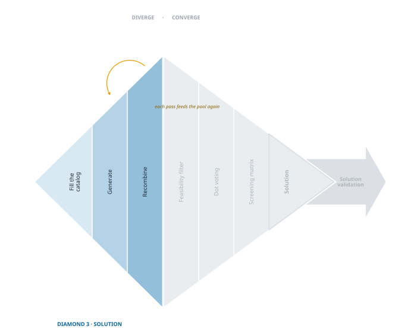
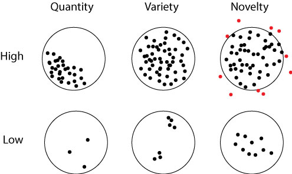

## Solution Ideation

{fig-align="center"}

The first two diamonds were about designing *the right thing*: choosing the people worth serving, then finding and validating a pain they actually live with. This third diamond is about designing *the thing right* — generating many candidate solutions, screening them down to the most promising, and testing whether the one you chose genuinely relieves that pain. The work changes; the rhythm does not. Diverge, converge, test.

You are at the start of the divergence. You have a validated pain and no solution, and the temptation is to reach for the first idea that presents itself. Resist it. The first idea is rarely the best one, and taking it forward costs you every idea you never had.

> If you want to have good ideas, you must have many ideas. Most of them will be wrong, and what you have to learn is which of them to throw away. [— Linus Pauling]{style="float: right;"}[^1]

[^1]: Linus Pauling won two Nobel prizes, one in chemistry (1954) for his work on the nature of the chemical bond and a second one in peace (1962) for his efforts to raise awareness about the dangers of nuclear weapons and his advocacy for nuclear disarmament. In this case we leverage his advice on how to get good ideas [@paulingImpactLinusPauling1995].

This chapter is the first half of Pauling's rule — getting many ideas. The next chapter is the second half, learning which to throw away.

Divergence here has three moves, and the diamond above names them:

1. **Fill the catalog** — stock the raw material creativity draws on.
2. **Generate** — produce candidates from that material, fast and without judgment.
3. **Recombine** — work the candidates you have into better ones.

Each move has tools. The moves matter more than the tools, because a tool you have not met can be learned in ten minutes, while skipping a move costs you the ideas it would have produced.

## Why This Works: Creativity as Recombination

 Creativity is not a spark that arrives from nowhere. It is recombination — putting together things you already carry, in an order nobody has tried. Picture the old card catalog in a library. Each card is a *percept*: a scrap of knowledge, an observation, a memory, an impression. Creative thought is the librarian's work of pulling cards and setting them side by side. Most pairings are nothing. Some are an idea.

That is a more useful theory than genius, because it tells you what to do. If ideas are recombinations, then the number of ideas available to you is governed by two things: how many cards you hold, and how deliberately you combine them. Both are trainable.

It also explains the frontier. The set of ideas reachable from your current cards is your *adjacent possible*[^2] — everything one recombination away. You cannot leap outside it, but you can enlarge it, and every new experience enlarges it a little. As a society accumulates cards, its collective adjacent possible grows faster still, which is why discovery accelerates rather than exhausting itself.

[^2]: The adjacent possible comes from the pioneering work of Stuart @kauffmanHomeUniverseSearch1995 which was extended to the logic of creativity and ideation by Steven @johnsonWhereGoodIdeas2010.

::: {.callout-note title="Ground Rules for the Whole Diamond"}
Divergence dies under evaluation. Before you begin any of the three moves, agree on three rules and hold to them:

- **Suspend judgment.** Critique has its place and its place is the next chapter. During divergence every idea gets room to breathe.
- **Welcome the unconventional.** The impractical idea is often the one that makes a practical idea possible three steps later.
- **Build, don't dismiss.** When an idea lands badly, ask what it could become rather than what is wrong with it.

These are the psychological-safety principles from *Organize for Innovation*, applied to a specific hour of work. A team that cannot suspend judgment cannot diverge, whatever tools you hand it.
:::

## Move One: Fill the Catalog

You cannot recombine cards you do not have. Everything in this diamond is limited by what you carry into it, which makes stocking the catalog the quiet prerequisite for the rest.

**Live widely, and pay attention while you do.** New experiences add cards. Research bears this out: multicultural experience predicts creativity across several measures, and the gains come from depth rather than exposure.[^mc] The entrepreneur's version is less exotic — go where you have not been, work alongside people whose jobs you do not understand, and stay long enough to stop being a tourist.

[^mc]: Multicultural experience predicts creativity across several measures [@leungMulticulturalExperienceEnhances2008], and the effect tracks time spent *living* abroad rather than merely travelling there [@madduxCulturalBordersMental2009]. Depth is what matters: the gains come through adapting to a second culture, not through exposure alone [@tadmorGettingMostOut2012].

**Observe as a traveler, even at home.** A traveler notices what residents have stopped seeing. That is the same attention you practiced in the second diamond, turned now toward mechanisms, materials, and workarounds rather than pains.

**Borrow other people's catalogs.** The fastest way to add cards is to sit with someone whose cards differ from yours. This is why interdisciplinary teams out-ideate homogeneous ones: they are not smarter, they are holding more kinds of card.

**Write it down.** Nobody retains it all. Keep an idea log — sketches, fragments, half-thoughts, photographs of odd solutions you pass in the street. The habit is common among creative people for a reason: a card you cannot recall is a card you do not have.

## Move Two: Generate

Now produce candidates, quickly and in volume. Two tools do most of the work.

### Brainstorming

Everyone knows brainstorming, and most groups do it badly — because they evaluate while they generate, and because the loudest voice sets the direction. Done properly it is fast and productive.

- **Record everything visibly.** Post-its or a shared board, one idea per note, so ideas can be moved and paired later. The physical rearranging is itself a recombination tool.
- **Withhold evaluation absolutely.** Not "later" — absolutely, for the duration.
- **Chase variety, not just volume.** Twenty variations on one theme is one idea with twenty coats of paint.
- **Facilitate.** Someone keeps the session moving, protects the quiet participants, and stops the drift into debate.

### 6-3-5 Brainwriting

Brainwriting is our primary generation tool, and the numbers explain why: **six** participants, **three** ideas each, **five** minutes a round. Each round, you pass your sheet to your right and use what you received as the prompt for three new ideas.[^4]

[^4]: Brainwriting was pioneered by Bernd @rohrbachCreativeRulesMethod1969 for marketing settings. It excels in all creative settings.

Run six rounds and the arithmetic is startling: **a team of six produces around a hundred ideas in about half an hour.** Teams do not believe this until they have done it. Most people are frightened of idea generation and expect it to take days of staring; brainwriting turns it into a timed, structured, almost mechanical half hour. That reframing is worth more than the technique itself.

It also fixes brainstorming's two failure modes. Nobody can dominate, because everyone writes simultaneously. And nobody can evaluate, because everyone is busy producing. What you get instead is *building*: each sheet arrives carrying someone else's thinking, and you extend it rather than judge it.

::: {.callout-tip title="Running It Well"}
- Adjust the numbers to your team; keep the structure. Four participants and four rounds still works.
- Keep every sheet. They are the raw material for the next chapter and for recombination.
- Debrief afterward, but not during. The session ends, then you look at what you have.
:::

## Move Three: Recombine

Generation gives you a pile of candidates. Recombination works that pile into better candidates — and this is the move teams skip, because it looks like effort and arrives dressed in overalls.

Skipping it is expensive. The ideas that come out of an hour of generation are mostly first thoughts. The elegant ones — the solutions that do more with less — usually appear on the second pass, when you take a concept you already have and deform it under a constraint.

Two tools do this deliberately.

### SCAMPER

SCAMPER is a checklist of transformations. Take an existing concept and apply each in turn:

| | Prompt | Example |
|---|---|---|
| **S**ubstitute | swap a component, material, or step | change the material and you may change the category |
| **C**ombine | merge two concepts or features | a camera and a phone |
| **A**dapt | move it to another context or user | the same mechanism, a different market |
| **M**odify | exaggerate or shrink an attribute | what if this were ten times larger? |
| **P**ut to another use | solve a different problem with it | a technology borrowed from another industry |
| **E**liminate | remove something essential | what remains, and is it enough? |
| **R**everse | invert the order or direction | run the process backwards |

The value is not any single prompt. It is that the checklist forces you past the pairings you would have found on your own — it manufactures the collisions that serendipity would otherwise have to supply.

### Systematic Inventive Thinking

SIT is the more disciplined cousin, and it is aimed squarely at *elegance*. Where SCAMPER opens options, SIT works inside the constraints of the thing in front of you — subtraction removes an essential component and asks what the remainder is good for; task unification makes one element do a second job.[^sit] The results tend to be leaner solutions rather than more elaborate ones, which matters because the elegant solution is usually the buildable one.

[^sit]: For detail on Systematic Inventive Thinking, see @goldenbergFindingYourInnovation2003 and @boydBox2013.

You will meet SIT again in the next chapter. Screening does not only eliminate concepts — it reveals which *features* of the losing concepts outperformed, and those features are exactly what recombination is for. That is the loop back into this move, and it is one of the most productive rounds you will run.

### Serendipity Favors a Full Catalog

Some recombinations arrive unbidden — the accidental discovery made while looking for something else.[^3] Serendipity is not the opposite of method; it is what method makes likely. A full catalog and a question you are actively holding produce more accidents than an empty catalog and no question.

[^3]: Horace Walpole coined *serendipity* in a letter of 1754, taking it from a Persian tale whose three princes of Serendip kept finding things they were not looking for [@silverPrehistorySerendipityBacon2015].

<!-- Claude 2026-07-30: an earlier version claimed the iPod click wheel WAS developed by
combining a padlock dial with a music player. That origin story is widely repeated but I
could not source it, so the causal claim is removed and the pairing is offered as an
illustration rather than a history. Restore the original if you have a source you trust. -->
The deliberate version is a forced pairing: take two unrelated things and insist on a connection. Pair a padlock's dial with a digital music player and you are not far from Apple's iPod click wheel. Forced pairings work because they push you out of the categories you already think in.

## When Have You Diverged Enough?

Judge the pool on three measures, not one.

**Quantity (fluency).** The raw count. It matters because good ideas are a proportion of all ideas, but count only distinct concepts — twenty variants of one idea is one idea.

**Variety.** Sort the pool into groups. If everything lands in two or three clusters, you have explored a narrow slice of the possible and should return to recombination with a different constraint.

**Novelty.** How far the pool reaches beyond the obvious. Keep the seemingly infeasible ideas. They are frequently unusable as stated and frequently the parent of something usable.

{width="60%"}

A pool that is large, varied, and reaching is ready for screening. A pool that is large but narrow is not — it is one idea wearing many hats, and screening it will simply hand that idea back to you.

## What You Carry Forward

You entered this chapter with a validated pain and no solution. You leave it with a pool of candidates, deliberately built rather than stumbled into: cards stocked, candidates generated in volume, and the best of them worked into better ones.

That pool is the whole point. An innovator who fixates on a single idea is making a low-probability bet and usually does not know it — the idea feels compelling precisely because there is nothing beside it for comparison. Breadth is what makes the next chapter's screening meaningful, and screening is what turns a pool into a choice.

Which is Pauling's second half, and the next chapter's work: learning which of them to throw away.
