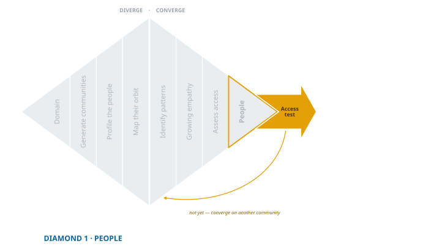

## Run an Access Test {.unnumbered}

{fig-align="center"}

You have chosen a community to search. You explored widely, converged thoughtfully, and selected with care. Before you spend months learning from them, there is one step that can save you all of it: **access testing**.

The question is simple. *Can we actually reach the people we want to learn from?*

It is easy to assume that because you can imagine your people, you can find and talk to them. But ventures fail when teams build for people they cannot observe or engage. This is the gate that closes the first diamond, and it is the cheapest gate in the book. A few days here can prevent a wasted quarter.

## What Counts as Access

Access is not sending a survey or getting a few replies to a direct message. It is confirming that you can build a reliable, ethical, ongoing channel of interaction. Three conditions, all of them:

1. **You can find them.** You know where they gather, online or offline, and can reliably locate them: a subreddit, a neighbourhood, a school, a profession, a hospital waiting room.

2. **You can engage them.** There is a viable way to start an interaction, whether that is conversation, observation, or something in between. The format has to fit their lives, not yours.

3. **They respond, and they open up.** Access is not reach; it is reciprocity. Your people reply, reflect, and reveal. They are willing to talk, and willing to go past the first answer.

::: {.callout-tip title="Minimum Conditions for a Passed Access Test"}
- You know **where** your people are
- You can **interact** with them directly
- They are **responsive and willing to engage**
:::

Miss any one of them and your access is not yet strong enough. That is not failure. It is a signal, arriving while it is still cheap to act on.

## What You Actually Do

A good access test is low effort and high signal. You are not gathering findings yet; you are testing your ability to gather them later. It might look like:

- posting an open question in a relevant group or subreddit
- sending cold messages to five or ten potential participants
- visiting a physical location to watch the flow and see who is available
- asking for brief conversations and tracking how many say yes

Keep score while you do it. Not elaborately, but write down how many you approached, how many answered, and how long the answers were. A test you cannot summarise in numbers is an impression, and impressions are generous to whatever you already believed.

Two or three rich conversations from ten honest attempts is a pass. Twenty polite one-line replies is not, and it is the result most likely to be mistaken for one.

## The Trap of the Easy Yes

The most dangerous outcome of an access test is not silence. It is agreeable people who are not your people.

Friends, classmates, and family will answer. They will be generous with their time and tell you what you hoped to hear, because they want you to succeed. Their responses feel like validated access and are nothing of the sort. If your respondents are mostly people who would return your call for reasons unrelated to the problem, you have tested your social network rather than your access.

The check is direct: *if I did not know this person, would they still have talked to me?* If the answer is no for most of your sample, run the test again through a channel where nobody owes you anything.

## When It Is Not Working

If your messages go unanswered, if you cannot find where your people spend time, or if conversations die after two sentences, pay attention. The problem might not be your concept. It might be your choice of people.

::: {.callout-warning title="When Access Isn't Working"}
- You can't find where your people spend time, physically or online
- You rely entirely on personal connections (friends, classmates, roommates)
- People are willing to talk but only give surface-level responses
- Your target group is too broad to locate or segment effectively
- You're targeting vulnerable or stigmatised groups without a path through gatekeepers or a clear ethical strategy
- You assume access is working because one person responded, but can't repeat it
:::

You have three moves, and they are not equally good.

**Change the channel.** Often the group is reachable and your route to them is not. A cold message fails where a gatekeeper introduction succeeds. Go back to the orbit you mapped during divergence: the charge nurse, the group moderator, the school counsellor. This is the first thing to try, and it works more often than teams expect.

**Redefine the group.** Sometimes a slight shift makes an unreachable population reachable, and the shift is often *toward* the orbit rather than away from it. Not "people in crisis" but "the volunteers who staff the line."

**Go back to your shortlist.** If neither works, return to convergence and choose again. This is not lost time. It is the first diamond doing precisely what it exists to do, at the only point where the correction is still cheap.

## A Word About Sampling

We return to sampling in the next chapter, but it is worth saying now: access problems almost always become sampling problems. If you only talk to people who are close to you, unusually responsive, or especially available, your findings will lean the way those people lean. A passed access test tells you that you can reach a broad slice of your chosen group, not just the easy few.

The bias is quiet and it compounds. Every later stage inherits the sample this one produced.

## You Do Not Have Your People Yet

You have a community to search. You do not yet have *your people*, and the difference is not pedantry. Your people are the group a shared pain defines, and the pain is what the next diamond is for. You started with socio-demographic clues (age, role, setting) and will end by defining your people through **shared unmet needs**.

When those needs start to surface, your early conversations may sound chaotic. Different themes from different people usually means you are talking to several pain subgroups at once. That is not failure; it is the first sign of the re-convergence to come. In the next diamond the pain and the people narrow together, and you will use personas and experience maps to find the boundary that pain draws rather than the one demographics drew.

Keep listening. The real community is only beginning to take shape.

---

Before moving on, run one yourself. Use the [Access Test Guide](toolkit/People_Test_Guide.qmd) to design and run a quick access check with your chosen group, and see how the Halo Alert team confirmed access in their [Access Test Demo](demo/exp-03-access-test.qmd).

---

## What You Need to Move Forward

You are ready to begin ethnographic discovery when:

- you can locate your people in specific places or digital communities
- you can interact with them in a format that matches their lives
- they respond, not once, but with depth and openness
- you are not relying on convenience or personal connection
- you are prepared for the community to narrow as patterns emerge

Access is not a checkbox. It is a gate, and the first diamond is not finished until you have passed through it on evidence rather than assumption.

What comes next is discovery. You will step into their world not to confirm what you expect but to learn what they cannot yet articulate: the quiet signals of persistent pain, the workarounds they stopped noticing, the needs they do not know they have.

You are no longer circling from a distance. You are entering the field.
