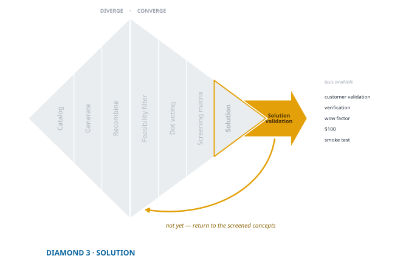

## Testing Solutions

<!--  -->
{fig-align="center"}
Developing a solution is just one milestone in the innovation journey. The real challenge lies in validating this solution - a process that unfolds through a sequence of prototype testing. Unlike a one-off test, this entails a series of progressively complex and costly experiments. Each stage of this validation journey is designed to incrementally align your solution more closely with your customer's pain points and expectations.

Validating a solution is a nuanced balancing act. It requires ensuring that your solution not only addresses the identified customer pains but is also technically feasible and economically viable. Each prototype test acts as a pivotal moment, providing crucial feedback and insights. This feedback is instrumental in making necessary adjustments and enhancements to your solution.

For entrepreneurs, this iterative process of testing and refining is indispensable. It's the bridge that turns abstract ideas into concrete, market-ready products. It significantly lowers the risk of market failure and heightens the chances of creating a solution that genuinely resonates with customer needs. This chapter delves into the various stages of prototype testing. It highlights the pivotal role of customer feedback and outlines practical strategies for refining your solution.

<!-- {#fig:test-solution fig-align="center"} -->

## Testing with Prototypes

In the innovation process, prototyping is often viewed as an end in itself, a stepping stone towards the finished product. However, this perspective can be misleading. Prototypes should not be the destination but the means to navigate through the innovation journey. Their true value lies in helping resolve uncertainties at each stage of development. The choice of prototype should be driven by your current knowledge, the uncertainties that remain, your hypotheses, and the specific aspects you need to test. Throughout this journey, the nature of prototypes evolves, aligning with the changing demands of the innovation process.

Innovation requires a variety of tests to converge towards a successful solution. Each test type targets different aspects of the product and its market fit. It's essential to select the right test based on the current stage of development and the specific unknowns you need to address.

Two different distinctions are at work here, and it is worth separating them, because they are easy to confuse. The first is about *how you are reasoning*. An **exploratory** experiment generates possibilities when you do not yet know enough to state a hypothesis; a **confirmatory** experiment tests a hypothesis you already hold. You lived in the exploratory mode through the first half of the second diamond. By this point, almost everything you run is confirmatory — you formed your hypotheses about the people, the pain, and the solution in the diamonds behind you, and now you are putting them under pressure.

The second distinction is about *what the test asks*. **Validation** asks whether you are solving the right problem for the right people. **Verification** asks whether the thing can be built and works as intended. Validation faces the customer; verification faces the workbench. One prototype often serves both — the same rough model can reveal whether a customer's face lights up and whether the mechanism jams.

Keep them straight, because they fail differently. A solution can verify perfectly and never validate: it works exactly as designed and no one wants it. That failure is the one this book exists to prevent, and it is why validation comes first here.

### Validation Testing {#sec-validation-test}

Validation testing, which we have previously seen in the context of customer pain, is essential to confirm that the solution effectively addresses the customer's needs. This form of testing delves into understanding and confirming aspects like customer identity, pain points, and the effectiveness of the proposed solution. Validation testing seeks to answer questions such as:

-   Who exactly is the customer?
-   What are the specific pain points of the customer?
-   Does the proposed solution effectively alleviate these pain points?

### Verification Testing {#sec-verification-test}

Verification testing, on the other hand, focuses on the technical feasibility and functionality of the solution. This type of testing involves creating progressively advanced prototypes to determine if the solution can be built and how. Key questions addressed in verification testing include:

-   What features and functionalities should the solution possess?
-   Is the solution technically feasible to build?
-   What is the optimal approach to constructing the solution?

Verification testing embodies the traditional notion of prototyping, where each iteration brings you closer to understanding the technicalities and feasibilities of your solution. Unlike validation testing, which is more customer-centric, verification testing is about the internal capabilities and technical aspects of the innovation.

### Wow Factor Testing {#sec-wow-test}

The "Wow Factor Test" is a critical validation tool that gauges the emotional connection and appeal of your innovation to potential customers.[^1] This test helps you understand not just the acceptance but the excitement generated by your product. It involves directly interacting with your target audience to gather their candid reactions and insights.

[^1]: The wow factor test is explained in detail in the work of @swensonFindingDevelopingNew2013.

#### Conducting the Wow Factor Test {.unnumbered}

To effectively conduct a Wow Factor Test, follow these steps:

1.  **Presentation**: Introduce the innovation to potential customers, clearly explaining its intended purpose and functionality. This step sets the stage for informed feedback.

2.  **Emotional Connection Assessment**: Ask the customers to rate their emotional connection to the innovation on a scale of 1 to 10, where 1 signifies a poor concept and 10 indicates a concept that elicits a 'wow' response.

3.  **Positive Feedback Collection**: Seek specific feedback on what aspects of the innovation customers find appealing. Questions could include:

    -   "What aspects of this product idea appeal to you?"
    -   "What benefits do you foresee in using this product?"
    -   "In what situations would you see yourself using this product?"

4.  **Negative Feedback Collection**: Inquire about any reservations or dislikes regarding the innovation. Ask questions like:

    -   "What elements of this product idea do you dislike?"
    -   "Are there any shortcomings or deficiencies you perceive?"
    -   "What could be potential barriers or reasons for not purchasing this product?"

5.  **Improvement Engagement**: Actively involve the customers in the ideation process for improvement. Questions might include:

    -   "How could we enhance this product?"
    -   "What modifications would make you more likely to purchase it?"

6.  **Group Summary**: Conclude the session by summarizing the key points. This could involve asking the group to reflect on the major learnings and takeaways from the discussion.

#### Assessing the Wow Factor {.unnumbered}

@swensonFindingDevelopingNew2013 suggest an average score of about 7.5 as the point where a concept looks promising — high enough to signal a real emotional connection rather than polite approval. Treat that as their rule of thumb, not a constant: it comes from one ideation practice, and your own market and customer base may justify a different bar. What matters more than the number is that you set the bar *before* you run the test.

Through Wow Factor Testing, you gain valuable insights into the emotional resonance of your product, a crucial aspect often overlooked in technical feasibility studies. This process ensures that your product not only meets the functional requirements but also creates a meaningful connection with your target audience.

### \$100 Test {#sec-100-test}

The "\$100 Test" is an effective technique for identifying the most valued features of your product from the customer's perspective. This test is particularly useful in discerning the Minimum Viable Product (MVP) and avoiding feature creep, ensuring that the product remains focused on what the customer truly wants.[^2]

[^2]: For more detail on the \$100 test, see @furrNailItThen2011.

#### Conducting the \$100 Test {.unnumbered}

To execute the \$100 Test, follow these steps:

1.  **Pain and Solution Explanation**: Present the hypothesized customer pain and your proposed solution, either in person or through a survey. Emphasize the importance of their input in refining the solution.

2.  **Feature Listing**: Provide a comprehensive list of potential features that could be included in the product. This list should be extensive and cover various aspects of functionality, design, and user experience.

3.  **Hypothetical Investment**: Ask customers to allocate a hypothetical budget of \$100 across these features, investing more in the features they value the most. This exercise forces customers to prioritize features based on their perceived importance and utility.

4.  **Feature Prioritization**: Analyze the allocation of funds across different features to identify the most valued ones. This data will guide you in trimming down the feature list to those that are essential from the customer's perspective.

#### Analyzing the Results {.unnumbered}

Upon completion of the test, you'll likely observe a trend where certain features consistently receive higher investments from customers. These are the features that hold the most value and should be prioritized in the MVP.

Be aware that different customer segments might value different features. If such segmentation emerges, it may indicate varying pain points or preferences among your customer base. This insight can be valuable in further refining your understanding of the customer and tailoring your product accordingly.

The \$100 Test is a powerful tool in the solution validation process. It helps in focusing development efforts on what matters most to your customers, avoiding unnecessary complexity, and ensuring that your solution remains aligned with customer needs.

### Wizard of Oz Test {#sec-wizard-test}

The "Wizard of Oz Test" is an innovative approach to prototype testing that involves creating an illusion of a fully functional product, where the behind-the-scenes manual operations are hidden from the user.[^3] It allows innovators to test and refine the concept of a product before its actual technical development.

[^3]: The wizard of Oz test is inspired by the classic narrative of L. Frank Baum's novel *The Wonderful Wizard of Oz* [@baumWonderfulWizardOz1900].\
    This sort of testing has also been called the mechanical Turk test. In 1770, Wolfgang von Kempelen presented a chess playing automaton (robot) to Empress Maria Theresa of Austria. Over the years, he would challenge humans to play chess against his machine and the machine usually won. It was eventually revealed that the mechanical Turk was a hoax with a small hiding place for a chess master and a system of mirrors to see the chess board and manipulate the automaton to move the pieces.\
    Much more recently, Amazon created a crowdsourcing service, also named Mechanical Turk or MTurk, where the public is invited to do tasks that computers cannot easily do. To avoid confusion between the centuries-old automaton and the recent Amazon crowdsourcing service, we now usually adopt the name wizard of Oz test.

#### Implementing the Wizard of Oz Test {.unnumbered}

1.  **Creating the Illusion**: Develop a basic prototype or a presentation that simulates the product's functionality. This could be as simple as a PowerPoint animation or a mock-up interface.

2.  **Manual Operation**: The test requires manual input behind the scenes to simulate the product's functions. This could involve a team member entering data, manipulating the prototype, or otherwise creating the impression of a working product.

3.  **Customer Interaction**: Present the prototype to potential customers and observe their interaction with it. Encourage them to use it as they would a fully functional product.

4.  **Feedback Collection**: Collect feedback on the product's concept, usability, and perceived value. Pay close attention to how users interact with the prototype and any difficulties or confusion they encounter.

5.  **Adapting to User Input**: Be prepared for scenarios where users go off-script or try unexpected actions. These instances can be particularly revealing and guide future development.

#### Example: Innovating for Rock Climbers {.unnumbered}

Consider the case of a team developing a social media tool for rock climbers. They hypothesized various performance metrics that might interest climbers. After receiving feedback on conceptual and rough prototypes, they decided to focus on a device that could monitor climbing speed and altitude.

During the Wizard of Oz test, climbers were given a prototype that seemed to record their climbing data. In reality, a team member manually recorded the data, which was then shown to the climbers post-climb. This test revealed climbers' interest in data comparing their performance over time and against others, while services for finding new locations were less valued.

The Wizard of Oz Test is a powerful tool in the early stages of product development. It offers an opportunity to validate a product's concept and functionality with minimal investment in technology development. By focusing on user interaction and feedback, this method can significantly inform and refine the final product design.

### Smoke Testing {#sec-smoke-test}

Every test so far has had the same flaw, and it is worth naming before the remedy. You recruited the people. You found them, you asked them, and they answered knowing they were helping you. They are *potential* customers, and they are your customers only to the degree that your sampling was right. Some of them were never going to buy from anyone, and they have been politely leading you astray.

Smoke testing removes the recruiting. You put a convincing prototype in front of people who were **already looking for a solution** and had no idea you existed, then watch what they do. Their behavior is genuine because they have every reason to believe your solution is there to help them.

Prospectors in the old West took their nuggets to an assay office to be certified as genuine. In innovation, customers are the only assayers there are, and this is the test that takes your ore to them.

#### The Landing Page Is an Experiment, Not a Brochure {#sec-smoke-experiment}

This is the part that goes wrong most often, and it goes wrong quietly because the output looks like success either way.

A brochure asks *do you like it?* and the answer is almost always some form of yes. An experiment asks a question whose answer could be **no**, and whose answer changes what you do next. Both produce a page with a headline and a button. Only one of them teaches you anything.

So design the page the way you designed every other experiment in this book: decide what you are asking, decide what result would change your mind, and only then build the thing that asks it. What varies on the page is the instrument.

**One page, one question.** The default and usually the right choice. Does anyone want this at all? Set your conversion threshold before you launch, not after you see the number.

**Two hooks, one offer.** Same solution, two headlines framing two different pains. Which one converts tells you which pain is live. That is a Diamond 2 finding arriving through a Diamond 3 instrument, and it is often the most valuable thing a smoke test returns.

**Two value propositions, one pain.** Same difficulty, different promises about how you relieve it.

**A feature list you measure.** Put the features on the page and watch which ones draw attention and clicks. This is the [\$100 test](#sec-100-test) run passively, on strangers, without asking anyone anything.

**Different segments, matched pages.** Point ads at two or three different slices of your community and see which converts. This one tests something no other instrument here can reach: it tells you *who your people are*. If the night-shift slice converts at triple the rate of the general one, you have just drawn a boundary with behavior instead of with interview quotes. Take it back to [From Community to People](toolkit/Pain_Guides.qmd#sec-boundary).

::: {.limit}
**How much traffic a comparison needs**

Two variants split your traffic in half and you need enough conversions in *each* arm for a difference to mean anything. Most first smoke tests do not have that, and a split test on thin traffic returns noise wearing the costume of a finding.

If your budget is small, run one question at a time and run it properly. Sequential beats simultaneous when traffic is scarce, and a clear answer to one question beats an ambiguous answer to three.
:::

#### Where It Does Not Work {#sec-smoke-limits}

Smoke testing depends on customers searching for solutions online, and not all of them do. Medical professionals do not browse the web for new devices; they meet them at conferences or through sales agents who visit. Many business-to-business buyers will never encounter you through a search. Where the buying journey does not pass through a search box, a smoke test tells you about the internet rather than about your customer.

It also depends on the prototype being convincing. If it does not read as a real solution, people leave, and you cannot tell that from people leaving because the solution is wrong. Those two failures produce the same number.

::: {.trap}
**Selling something you cannot ship**

If your call to action invites a purchase and you are not ready to fulfil one, you owe the visitor the truth on the next page: you are refining the product, and they will be first in line. Then honour it.

This is not only ethics, though it is that. A smoke test run dishonestly poisons the only channel where these people were willing to find you, and they are the most valuable respondents you will ever have — they arrived looking.
:::

The procedure, including what a landing page has to contain and what to count, is in [Solution Guides](toolkit/Solution_Guides.qmd#sec-smoke-guide).

### Profit Analytics Testing {#sec-profit-test}

Profitability Analytics Testing is focused on assessing the financial viability of your solution. This test measures the customer's perceived value of the solution, reflected in their willingness to pay. A well-understood customer pain, addressed with an effective solution, typically leads to higher customer valuation.

#### Concept of Profitability Testing {.unnumbered}

1.  **Understanding Customer Valuation**: The core of profitability testing lies in evaluating how much customers are willing to pay for your solution. The farther the solution is from effectively addressing the customer's pain, the less they are willing to pay.

2.  **Demand Curve Estimation**: A key tool in this test is the demand curve, which charts the relationship between price and quantity demanded. It serves as an indicator of how much customers value the product. Unlike established firms, innovators often find it easier to estimate the demand curve for a new product.

3.  **Calculating Profit Function**: Once the demand curve is established (e.g., $\mathsf{Q = 100 - 2P}$), the next step is to calculate the profit function, $\mathsf{\pi = (P-c)Q - f}$. Here, $\mathsf{Q}$ is the quantity demanded, $\mathsf{P}$ is the price, $\mathsf{c}$ is the unit variable cost, and $\mathsf{f}$ is the fixed cost.

4.  **Maximizing Profit**: The objective is to find the price point that maximizes profit, utilizing methods like calculus, simulation, or optimization. This price point reveals the highest potential profit from the innovation.

#### Decision Making Based on Profitability Testing {.unnumbered}

-   **Interpreting Results**: If the expected profit is low or negative, it suggests that the innovation may not be financially viable and reconsideration or abandonment might be wise.

-   **Positive Outlook**: Conversely, a high expected profit indicates a strong market potential, justifying further investment and market entry.

-   **Detailed Analysis**: This section introduces what the test does and when it belongs; it is not enough to run one. For estimating demand curves and computing expected profit properly, see [*Is This Worth Doing?*](https://ea.nilehatch.com/), which is that method's book.

Profit Analytics Testing stands as a critical final validation step, combining financial analysis with customer value perception. It moves beyond theoretical customer feedback, grounding the innovation's potential success in tangible economic terms. This testing phase helps entrepreneurs make informed decisions about market entry, backed by a clear understanding of the innovation's financial prospects.

## Prototypes and Prototyping

Prototyping serves as a vital tool in innovation, not as an end goal but as a means to conduct essential tests. It's the iterative process of creating prototypes that aids in unraveling uncertainties and refining the solution.

### The Role of Prototypes in Testing

1.  **Prototyping as a Vehicle for Testing**: Prototypes are representations created for testing hypotheses. They counteract the premature optimization of solutions by providing a cost-effective means for quick, iterative testing.

2.  **Adapting Prototype Fidelity and Cost**: Prototypes vary in their resemblance to the final product and in their cost. The key is to choose a prototype that matches the testing needs without incurring unnecessary expenses. For instance, to test if a defibrillator would be noticed in a public space, a simple sign indicating its presence could suffice, rather than a complete, functional unit.

### Types of Prototypes

1.  **Virtual Prototypes (Drawings)**: These are initial sketches or computer-generated images representing the solution. They are useful for initial conceptual validation but cannot confirm solution viability or build feasibility.

2.  **Rough Prototypes (Cobbled Together Junk)**: Created with readily available materials, rough prototypes are tangible and allow for early user interaction. Observing customers interact with these prototypes can unveil critical insights about their preferences and pain points.

3.  **Rapid Prototypes (Creative Materials)**: Rapid prototyping technologies like 3D printing and foam core milling offer ways to create more refined prototypes quickly and cost-effectively. These can range from basic looks-like models to more sophisticated works-like prototypes, depending on the stage of innovation and the specific tests required.

### Leveraging Prototypes for Customer Insights

-   **Clarifying Pain Points**: In the early stages, simple prototypes can help clarify customer pains, offering tangible points of discussion for customers to articulate their needs and dislikes.

-   **Iterative Learning**: As the innovation progresses, prototypes should evolve in fidelity, moving from basic sketches to more detailed representations. This progression allows for deeper and more precise customer feedback.

-   **Balancing Fidelity and Cost**: The art of prototyping lies in balancing the need for detailed, accurate representation with the constraints of time and budget. Each prototype should be just detailed enough to test the current hypothesis, avoiding over-investment in unnecessary details.

In conclusion, prototyping is a dynamic and essential component of the innovation process. It's not just about creating a physical representation of an idea but about using that representation as a strategic tool to learn, iterate, and refine. Effective use of prototypes can significantly reduce risks, optimize resource usage, and increase the likelihood of arriving at a solution that genuinely resonates with customer needs.

## Conclusion

In concluding this chapter on validating solutions with prototypes, it's crucial to reemphasize the iterative nature of this process. As every diamond in this process has shown, innovation is a journey of building, testing, and iterating. Each stage of prototyping and testing helps in progressively reducing uncertainty and crystallizing the solution.

### Every Test Also Asks a Question Back {#sec-tests-teach}

There is a second output from all of this that is easy to discard, because it does not look like a result.

Every test you run is also an interview. When someone rejects a concept, the reason they give is a **market requirement you did not have**, and you will collect more of them in a week of testing than in a month of exploration, because rejection needs something concrete to push against. Nobody holds an opinion about whether a safety device might be used against them until you describe one that could be.

So log the objections, not only the verdicts. What did they say it would have to do? What did they assume it would do and find it did not? What made them hesitate before they answered? A test that eliminates a concept and hands you three requirements has done more for you than one that confirms a concept and hands you nothing.

Then take them back to the [screening matrix](Hypothesize_Solution.qmd#sec-second-pass). Once is normal. You are adding rows to a table you already built, using evidence you gathered anyway, and occasionally you will find that a concept you dropped deserved better or a concept you kept does not survive the fuller list.

### Matching Tests with Prototypes

-   **Strategic Choice of Tests and Prototypes**: The choice of which test to use and which prototype to employ should align with the specific questions and uncertainties you are addressing. For example, a rough prototype suffices to check if a defibrillator is noticeable, while material testing might require more sophisticated prototypes.
-   **Iterative Refinement**: Through successive rounds of testing and refinement, prototypes evolve, moving from simple representations to more complex and accurate models. This evolution is guided by the feedback obtained and the learning accrued at each stage.

### Toward Solution Release

-   **Transitioning from Innovation to Commercialization**: As you resolve uncertainties and refine your solution, the focus gradually shifts from innovation to preparing for market entry. This transition marks the point where you have enough confidence in your solution to consider business model development and commercialization.
-   **The Journey Ahead**: The journey of innovation doesn’t end with the final prototype. It seamlessly leads into the next phase of bringing your solution to the market, where new challenges and opportunities await.

The path from a concept to a market-ready solution is not linear but a series of informed steps, each building upon the learnings of the previous. By carefully selecting your tests and prototypes and adapting them to your evolving understanding of customer needs, you pave the way for a solution that not only addresses the identified pain points but also holds the potential for successful commercialization.
