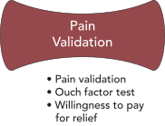

# Validate Customer Pain {#sec-test-pain-chapter}

#### Use confirmatory testing to determine whether the pain hypothesis is supported {.subtitle}

## Validating Pain Hypotheses

<!--  -->
{.print-w-25 .wrapfig_right_25}
You’ve felt the spark of empathy. You’ve clustered stories, built personas, even mapped out experiences. At this point, it’s tempting to believe you already *know* the pain. You can picture Maya stuck in traffic, her kids waiting at daycare, the anxious clock-watching that defines her commute. It feels so real you might be ready to jump ahead to brainstorming solutions.  

But here’s the catch: empathy and plausible reasoning aren’t enough. They give us insight, not evidence. As entrepreneurs, we’re not just storytellers — we’re investigators. We need to know whether the pains we’ve identified are truly **real, frequent, and urgent** in the lives of the people we hope to serve. Without that proof, we risk building around shadows — problems that people nod along to in conversation but don’t actually feel deeply enough to change their behavior.  

This is why we test pain hypotheses. It’s the final step in Diamond 2 and the bridge into Diamond 3. Until now, you’ve been generating and narrowing ideas about what hurts most. Now, you need to put those ideas under pressure. Testing tells you which pains are strong enough to anchor a business, and which ones are just background noise.  

Validation experiments don’t need to be elaborate. They need to be **deliberate**. A good test helps you distinguish between a pain that is interesting in theory and one that people are desperate to solve. It also protects you from two common traps:  

- **False positives**: when people politely agree but don’t truly care.  
- **False negatives**: when your method misses pains that are real but hidden.  

The work here is about designing small, sharp probes that reveal what really matters. Once you’ve done that, you’ll know which pain is strong enough to carry you forward — not just in a story, but in evidence that people will act on.  

::: {.callout-note title="How to Use This Chapter"}
Pair this chapter with the [Pain Validation Guide](toolkit/Test_Pain_Guide.qmd) and review the [Halo Alert – Pain Test Demo](demo/exp-10.a-pain-test-summary-2025-03-20.qmd). The chapter explains *why* testing matters; the guide and demo show you *how to run one yourself*.  
:::

## Pain Validation

The simplest way to test a pain hypothesis is to put it in front of people and ask if they experience it. You take the pains you’ve hypothesized and see whether they resonate. A direct check — “Do you deal with this?” — may sound almost too simple, but it often brings clarity.  

A stronger version goes beyond yes-or-no. Ask about recency and frequency: “When was the last time you ran into this?” or “How often has this come up in the past month?” These questions ground answers in real life instead of polite agreement.  

Another powerful refinement is **relative ranking**. Instead of asking whether a pain exists in isolation, ask people to compare across alternatives: “Which of these issues is most frustrating?” Ranking forces trade-offs and gives you a sharper sense of what matters most.  

::: {.callout-tip title="What Counts as Pain Validation?"}
- People can describe a *specific, recent instance* of the pain  
- The pain shows up with *some frequency* (not just once in a lifetime)  
- When ranked against other pains, it rises near the top  
:::

Pain validation works because it connects hypotheses back to lived experience. But it’s not perfect. People can nod along even if the pain isn’t central to their lives. They may also forget pains that show up less often but hit hard when they do. That’s why you rarely rely on pain validation alone — you combine it with the next probes.  

## Ouch Factor

Doctors have used pain scales for decades. “On a scale of 1–10, how bad is it?” Entrepreneurs can borrow the same logic. The **ouch factor test** asks people to rate the severity of a pain in their lives.  

The value here is quick prioritization. If one pain consistently gets rated an “8” while another averages a “3,” you know which one feels more pressing.  

But severity is slippery. A “7” for one person may be another’s “4.” And different groups measure pain on different scales. That means ouch scores should be treated as **relative signals, not absolutes**. Within a single group, they help you sort pains against each other. Across groups, they can mislead.  

To make ouch factors more meaningful, pair them with behavioral questions. Instead of just “How bad is this?” also ask, “What do you do today to deal with it?” or “How much time or money do you spend trying to make it better?” These responses anchor subjective pain ratings to actual effort.  

::: {.callout-warning title="Limits of Ouch Factor Tests"}
- Scores are *not comparable* across groups  
- A high number doesn’t always equal urgency  
- Treat results as *directional signals*, not proof  
:::

The ouch factor shines when it helps you narrow down a crowded list of possibilities. Just don’t mistake it for a universal measure.  

## Willingness to Pay for Relief

The most tempting test is to ask directly: “How much would you pay to make this go away?” At first glance, it seems like the ultimate validation — if people name a dollar amount, surely that means the pain is real.  

In practice, it’s rarely that simple. People don’t think in terms of paying for abstract “relief.” They imagine a solution, however fuzzy, and base their willingness to pay on that imagined product. If their mental picture is shallow, their answer will be low. If your later concept feels more concrete and credible, their willingness to pay often rises.  

That means early willingness-to-pay questions usually **understate** the real value of the pain. Instead of treating them as hard numbers, treat them as **relative comparisons**. Which pains would someone pay more to solve? Which pains make them hesitate?  

You can also sidestep hypotheticals by asking about substitutes. “What do you already spend to deal with this?” Late fees, stopgap products, wasted time — all of these reveal how costly a pain already is. These behavioral anchors often say more than a speculative number.  

::: {.callout-tip title="Better Ways to Probe Willingness-to-Pay (WTP)"}
- Ask about *current spending* on substitutes or workarounds  
- Compare *relative WTP* across pains rather than raw numbers  
- Save *dollar-value WTP* for later stages, once solutions are concrete  
:::

Use willingness-to-pay sparingly at this stage. It becomes much more powerful once you have concrete solution concepts. For now, it can serve as a directional probe alongside other tests.  

## Avoiding Pitfalls

Every test has its traps. The art is knowing how to spot them.  

- **False positives** happen when people agree politely, or exaggerate sympathy without true urgency. You avoid them by grounding questions in specifics: “When was the last time?” “What did you do?”  
- **False negatives** happen when people can’t recall or imagine pains in the way you’ve framed them. You avoid them by triangulating methods: combine validation, ouch factor, and behavioral checks so one fills the gaps of another.  
- **Over-reliance on one test** is perhaps the biggest mistake. No single probe is perfect. But when two or three point in the same direction, you can trust the signal.  

::: {.callout-warning title="Common Pitfalls in Pain Testing"}
- Accepting polite agreement as proof  
- Over-trusting a single ouch score  
- Taking raw WTP numbers at face value  
- Ignoring pains that are rare but *very costly*  
:::

The point isn’t to prove your hypothesis with scientific certainty. It’s to collect enough evidence that you can move forward with confidence, knowing you’re solving something real.  

## Closing the Loop

Testing your pain hypotheses isn’t about proving them beyond doubt. It’s about gathering enough evidence that you’re not chasing shadows. When your validation, ouch factors, and willingness-to-pay signals line up, you know you’re standing on solid ground. You’ve found pains that are not only felt, but felt often, felt deeply, and felt urgently enough that people are already spending time or money trying to ease them.  

That’s the foundation you need before you shift into Diamond 3. Only once you’re confident the pain is real does it make sense to ask: what could relief look like? Now the work turns from uncovering unmet needs to shaping answers. The next diamond is about design and validation of solutions — and you’ll enter it knowing you’re solving a problem that truly matters.  
