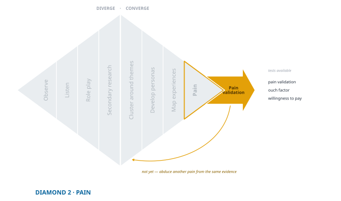

## Validating Pain Hypotheses

{fig-align="center"}

You have felt the spark of empathy. You clustered stories, built personas, mapped an experience. At this point it is tempting to believe you already *know* the pain. You can picture Maya on a dark street, checking her phone, walking faster than she wants to. It feels real enough that brainstorming solutions seems like the obvious next move.

Here is the catch. Empathy and plausible reasoning are not evidence. They produced a good guess, and a good guess is exactly the kind of thing that survives contact with reality by being agreeable rather than by being true. You need to know whether the pain you named is **real, frequent, and urgent** in the lives of the people you hope to serve. Without that, you risk building around a shadow: something people nod along to in conversation and do not feel deeply enough to change what they do.

::: {.column-margin .def-margin}
**Validation** — testing a hypothesis you already hold, to find out whether it survives. The opposite posture from exploration, where you had no hypothesis to defend.
:::

This is the last step in Diamond 2 and the bridge into Diamond 3. Until now you have been generating and narrowing ideas about what hurts. Now you put those ideas under pressure. Testing tells you which pains are strong enough to anchor a business and which are background noise.

Validation experiments do not need to be elaborate. They need to be **deliberate**. A good test distinguishes a pain that is interesting in theory from one people are already working to escape.

::: {.see-guide}
The [Pain Testing Guide](toolkit/Pain_Guides.qmd#sec-pain-testing) carries the question wording, the logging table, the intercept script, and the micro-survey. This chapter covers what the answers mean and when you have enough of them.
:::

## Who Does What

Unlike the last chapter, this one puts you back in front of people, so the three moments return.

**Prepare.** Drafting the questions, checking them for leading wording, deciding what to log. Hand this over. Your AI is good at it and it costs you nothing.

**Contact.** Asking a real person whether this is their life. Yours, and there is no version of this that is not.

**Synthesize.** Scoring the responses, comparing across people, noticing that one segment answered differently from another. Hand it back, then check the work.

The difference from exploration is what you are protecting against. There you were guarding against not hearing anything new. Here you are guarding against **hearing what you hoped to hear**, which is a harder problem because you will not notice it happening.

## Three Tests, and Why You Run Two

There are three probes at this stage, and each fails in its own way. Run at least two, chosen so their failure modes do not overlap.

### Pain Validation

The simplest test puts the pain in front of someone and asks whether they experience it. A direct check sounds too simple to be useful, and it often brings immediate clarity.

The stronger version goes past yes and no. Ask about recency and frequency. *When was the last time you ran into this? How often in the past month?* These anchor an answer in a real week rather than in a general impression, and a person who cannot name a single instance is telling you something even while they agree with you.

Stronger still is **relative ranking**. Rather than asking whether a pain exists on its own, ask people to compare: *which of these is most disruptive for you?* Ranking forces a trade-off, and trade-offs are harder to be polite about than agreement is.

::: {.threshold}
**Minimum Evidence for a Passed Pain Test**

- The person recalls a **specific, recent instance**, not a general impression.
- The pain occurs with **some frequency**, not once in a lifetime.
- It **ranks near the top** against the adjacent pains you offered.
- There is **observable effort or spend today**: time, money, or a workaround they built.

The fourth is the strongest and the easiest to leave out. Agreement is free and ranking is cheap. Having already rearranged your life around something is not.
:::

### Ouch Factor

Doctors have used pain scales for decades. *On a scale of one to ten, how bad is it?* The **ouch factor test** borrows the logic and asks people to rate severity.

The value is quick prioritization. If one pain consistently draws an eight while another averages a three, you know which one presses harder.

But severity is slippery. A seven for one person is a four for another, and different groups calibrate differently. Analyze scores **within one segment at a time**. Averaging an ouch score across two groups produces a number that describes neither of them.

To make severity mean something, pair it with behavior. Alongside *how bad is this*, ask *what do you do about it today?* and *how much time or money does that cost you?* A high score with no behavior attached is a person being agreeable about something that does not actually cost them much.

::: {.limit}
**What ouch scores cannot tell you**

Scores are not comparable across groups. A high number is not the same as urgency. Treat the result as a directional signal for sorting a crowded list, never as a measurement. It is useful precisely because it is quick, and it is unreliable for the same reason.
:::

### Willingness to Pay for Relief

The most tempting test asks directly: *how much would you pay to make this go away?* If someone names a dollar figure, surely the pain is real.

In practice it rarely works that way. People do not price abstract relief. They imagine a solution, however fuzzy, and price *that*. If the picture in their head is shallow, the number comes out low, and a more concrete concept later will often raise it. **Early willingness-to-pay answers usually understate the pain**, which means a low number here is weak evidence of a weak pain.

So use it as comparison rather than measurement. Which pains would someone pay more to end? Which make them hesitate?

::: {.key-action}
**Ask about behavior instead of hypotheticals.** *What do you already spend to deal with this?* Late fees, stopgap purchases, a subscription that half-solves it, two hours every Sunday. What someone already pays is a fact about their life. What they say they would pay is a forecast about a product that does not exist.
:::

Keep this probe light here. Its real home is later, once you have a concrete solution and a genuine pricing question, and that work belongs to [*Is This Worth Doing?*](https://ea.nilehatch.com/) rather than to this book. At this stage you are asking whether the pain is worth escaping, not what relief should cost.

## Preparing the Instrument

::: {.ask-ai}
**Ask Your AI**

::: {.prompt}
Here is my pain hypothesis and the segment it applies to. Draft a ten-minute intercept script that tests it two ways: pain validation with recency, frequency, and ranking against two adjacent pains I will supply, plus one behavioral question about what they already do or spend. Every question must be answerable by someone who has never heard of me or my idea. Flag any question that suggests its own answer, names a solution, or asks the person to predict what they would do. Then tell me which of my three pains this script will have the hardest time telling apart, and why.
:::
:::

::: {.checkpoint}
**Check before you take it into the field**

- **Read the last answer first.** If two of your pains are hard to tell apart in a script, they will be impossible to tell apart in the results, and you will not discover that until you are scoring them.
- **Strike anything that carries its own answer.** *How frustrating is it when…* has told the person what to feel before they have said anything.
- **Decide what you will log before you ask anyone.** Last occurrence, frequency, rank, effort or spend. A field you add after the first three conversations is a field you have for nobody.
:::

::: {.see-demo}
The [Halo Alert pain test](demo/exp-10.a-pain-test-summary-2025-03-20.qmd) shows all three probes run against one hypothesis, with the [validation detail](demo/exp-10.b-pain-validation-detail-2025-03-20.qmd), the [ouch scores](demo/exp-10.c-ouch-factor-detail-2025-03-20.qmd), and the [willingness-to-pay responses](demo/exp-10.d-wtp-detail-2025-03-20.qmd) recorded separately so you can see how they disagreed.
:::

## Reading the Signals Together

Two tests agreeing is worth more than one test agreeing loudly. What you are looking for is convergence, and the shape of the disagreement is informative when it does not arrive.

**Everything lines up.** Recent repeated instances, top ranking, high severity *with* time or money already going into it. Advance to solution exploration. This is what a validated pain looks like.

**High severity, no behavior.** Someone rates the pain an eight and does nothing about it. Believe the behavior. Either the pain is smaller than the number, or relief is impossible enough that they have stopped trying — and those two are worth telling apart, because the second one is an opportunity and the first is not. Ask what they would have to believe for a fix to be worth their time.

**Ranking that will not hold still.** If people rank your pains differently every time and no order emerges, the usual cause is that your pains are **too broad**. "Childcare stress" will not rank consistently against anything. "The late-pickup fee" will. Make them step-specific and run it again. This is the same failure that produces thin clusters one chapter earlier, showing up in a different instrument.

**Nothing lands.** Rare, one-off, consistently low rank, no workaround, no substitute spend. Archive it and go to your refrigerator. That is what you filled it for.

## The Pain That Is Rare and Devastating

The frame *real, frequent, urgent* has a blind spot, and it is worth naming because the tests above will walk straight past it.

Some pains are rare and catastrophic. A basement floods once every four years. A single missed dose puts someone in hospital. Frequency questions score these near zero, and a thirty-day recall window may not catch them at all. Yet people insure against exactly these, which is behavior, and behavior is your best signal.

So when a pain scores low on frequency, check severity and spend before you drop it. If someone is already paying to prevent something that has happened to them once, you have found a pain the frequency test cannot see. If they are not paying anything, the low frequency is probably telling the truth.

::: {.trap}
**Accepting agreement as evidence**

Four ways this stage goes wrong, all of them comfortable:

- **Polite agreement counted as proof.** The cure is a specific incident, a rank, and a behavior. Demand all three.
- **A single ouch score trusted.** One number from one person about a feeling is the weakest evidence you will collect.
- **Raw willingness-to-pay figures taken at face value.** They price an imagined product, not your pain.
- **Rare but very costly pains dismissed on frequency.** See above.

The unifying error is that every one of these lets you keep the hypothesis you arrived with.
:::

## Synthesizing What Came Back

::: {.ask-ai}
**Ask Your AI**

::: {.prompt}
Here are my logged responses. For each pain, report how many people recalled a specific instance, the frequency distribution, the ranking pattern, the ouch scores, and what people said they already do or spend. Keep the segments separate and do not average across them. Then tell me three things: where two tests disagree with each other, which of my pains has the weakest evidence and exactly what is missing, and what a skeptic would say about my strongest result. Do not tell me whether to proceed.
:::
:::

::: {.checkpoint}
**Check before you believe the summary**

- **Read the skeptic's case first**, before you read your strongest result. In the other order you will already be defending it.
- **Check that segments stayed apart.** A pooled average across two groups is a number about a population that does not exist.
- **Find the people who said no.** They are the most useful respondents you have, and a summary organized around your hypothesis will put them last or leave them out.
:::

## How Much Evidence Is Enough

This is where pain testing usually goes wrong, and not because people run too few conversations. They run enough and never decided in advance what would count, so the evidence gets read as support no matter what it says.

Set the bar before you collect. Two parts, and the second matters more.

**A floor on how many.** Pilot with eight to fifteen people in one segment, which is enough to find out that your wording is broken and not enough to conclude anything. Then grow toward twenty-five to fifty for a prioritization you would act on. These are floors and not targets: fifty polite agreements with no behavior attached is still nothing, and twelve people who all describe the same workaround is already something.

**A statement of what would change your mind.** Before you ask anyone, write down the result that would make you abandon this hypothesis. *If fewer than half can name a recent instance. If nobody has built a workaround. If it ranks last against the two pains beside it.* Written in advance, that sentence is a test. Written afterward, it is a rationalization, and you will not be able to tell the difference from the inside.[^falsify]

[^falsify]: The rule is Popper's. What makes a claim testable is that it forbids something, so you have to be able to say beforehand which observation would refute it [@popperScienceFalsification1963]. It transfers to entrepreneurship without modification, and it is the cheapest discipline in this book.

::: {.threshold}
**Enough to Move On**

You are done when you can say all four out loud:

- **Two independent tests point the same way** for the same pain, in the same segment.
- **Someone is already spending** time, money, or effort to escape it.
- **You can name the result that would have stopped you**, and it did not happen.
- **You know which of your pains failed**, and it is in the refrigerator rather than quietly forgotten.

If you cannot produce the third, you have not run a test. You have run a demonstration.
:::

One more check, borrowed from the end of exploration and just as useful here: ask whether the evidence stopped changing your mind, or whether you stopped asking questions that could. Those feel identical while you are in them.

## Into Diamond 3

You entered this diamond with a mountain of raw material and no idea which part of it mattered. You leave it with one pain that people can point to in their own week, that ranks above its neighbors, and that somebody is already paying something to avoid. You also leave with a record of the pains that did not survive, which is worth more than it looks: it is the reason you will not spend Diamond 3 rediscovering them.

Only now does the next question make sense: *what could relief look like, and would these people actually take it up?* That is Diamond 3, and it runs the same way this one did. You will widen first, generating far more candidate solutions than you need, then narrow to the one the evidence supports, then test it before you build anything.

Deciding whether to *commit* to what you find is a different question again, with its own logic, and it belongs to [*Make the Call*](https://mc.nilehatch.com/). Your job here was to make sure the thing you commit to is real. It is.
