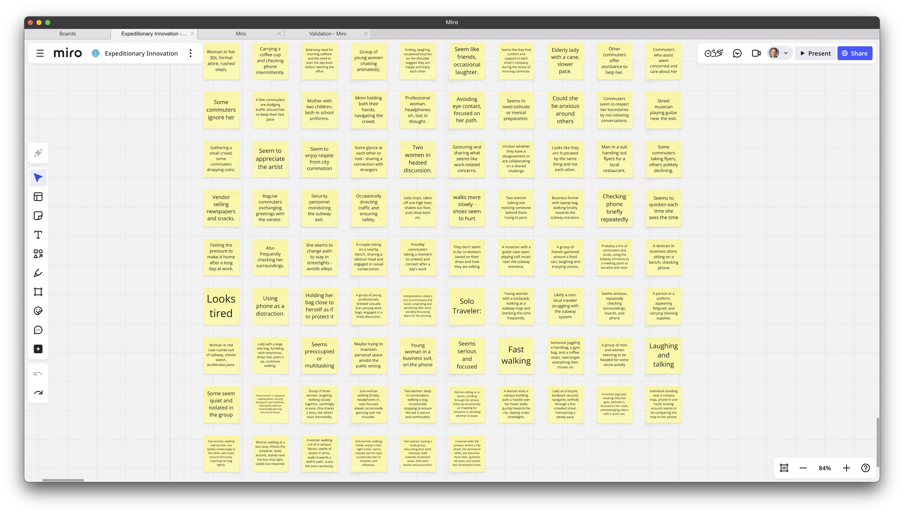
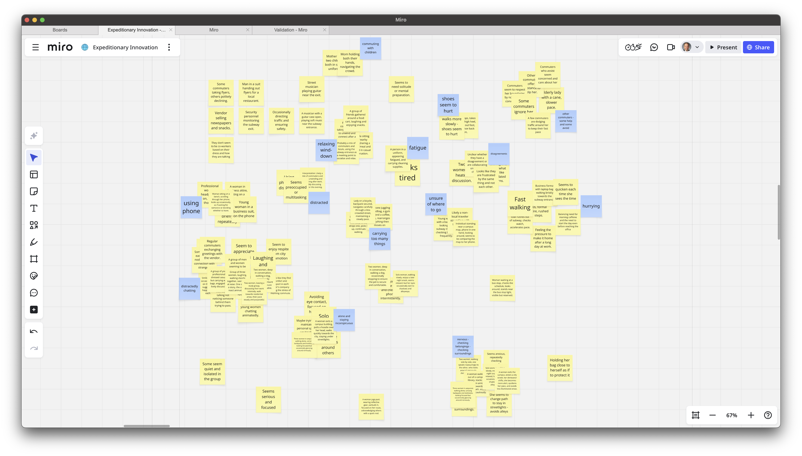

# Clustering Themes {#sec-cluster-ha .unnumbered}

#### From scattered observations to working themes {.subtitle} 

> Following the toolkit naming conventions, this file is named `exp-06-cluster-themes-2025-03-12.qmd`.

## Overview {.unnumbered}

This demo shows how we clustered **Halo Alert** [observations](exp-05.a-observation-2025-03-05.qmd) into themes using a **Miro board** (primary) with a **Google Sheet** as the import source (one observation per row). It pairs with the Toolkit: [Clustering Guide](../toolkit/Clustering_Guide.qmd).

> **Outputs you’ll see here**\
> - Screenshots of the clustering wall (before/after)\
> - The theme labels we settled on\
> - A short narrative explaining why each cluster holds together\
> - Links to the sample dataset and (optional) view-only Miro board\

## Files & Links {.unnumbered}

- **Sample dataset (Google Sheet):** [link → halo-alert-clustering-sample-sheet](https://docs.google.com/document/d/1bXnXDxHQFHoGwALlyIgDc2imnDhtmuR0NqYVRegRgbc/edit?usp=drive_link)
  - One observation per row; ready for Miro sticky import.
- **Miro board (view-only):** [link → halo-alert-clustering-board](https://miro.com/app/board/uXjVOYyhaPM=/?share_link_id=861713686923) *(optional)*

::: callout-tip
**How to replace placeholders**
- Update the two bracketed links above once you’ve shared the Sheet and Miro board.
- Export two screenshots from Miro and save them with the filenames shown. Keep them at ~1600–2000px wide for clarity.
:::

## 1. Clarify the Unknown

- **Question:** What unmet needs (pains) emerge repeatedly in women’s commuting experiences?
- **Why clustering now:** We’ve finished exploratory conversations and observations. Novelty is dropping; it’s time to **converge** by turning fragments into patterns.

## 2. Inputs We Clustered

We combined **quotes from interviews** and **notes from observations**. Each was reduced to a *single* movable unit (one per sticky).

**Examples of raw observations (short & concrete):**

- “I text my roommate when I leave campus so she can watch my ETA.”
- Avoids the shortcut street; takes a longer lit route; arrives 12–15 minutes later.
- “If a stranger walks directly behind me, I cross the street to re-establish space.”
- Checks phone intermittently; keeps keys between fingers on two blocks with low foot traffic.
- “Crowded trains make me vigilant; I grip my bag and plan my exit two stops early.”
- Family texts: “Ping me when you’re home.” If no ping by 10:30pm, they call.
- Headphones in, but no music after 9:00pm; uses them as a “do-not-engage” signal.

> These are examples only. The **full set** is in the sample sheet.

## 3. Method: Miro + Sheet Import

1. **Prepare the Sheet**
   - Column A = `observation` (one per row).  
   - Optional columns: `source` (interview/observation), `time`, `context`.

2. **Import into Miro**
   - In Miro: **Apps → Sticky Note Import** (or **Paste as sticky notes**).
   - Select Column A; each row becomes a sticky note.
   - Arrange stickies loosely; don’t categorize yet.

3. **Affinity Map**
   - Drag stickies into small groups where **similar meaning** emerges.
   - Start new clusters when a sticky doesn’t fit an existing group.
   - Keep moving until **repetition** and **coherence** feel strong.

4. **Name Clusters**
   - Add a short label (2–4 words) above each group.
   - Write a one-sentence “why this belongs together” note under the label.

> Paper alternative: write each observation on a sticky note; cluster on a wall; snap photos at each stage.

## 4. Before / After (Screenshots)

**Raw, ungrouped stickies**  

**After grouping & naming clusters**  

<!-- 
::: callout-note
**Reading the wall:** We place **stronger signals** (larger clusters, frequent repeats) near the center and **edge cases** toward the periphery. Oddballs that later attracted friends often became new clusters.
:::
-->

## 5. Resulting Themes (with Rationale)

Below are the **working themes** that emerged for Halo Alert. Your teams may arrive at different labels; what matters is that **each cluster earns its name** from the underlying evidence.

### A. Reassurance Routines
- **What’s inside:** “Text when you leave/arrive,” live-tracking links, timed check-ins.
- **Why it holds:** Repeated acts that **transfer anxiety** from the walker to a trusted other.
- **Signal:** Frequent; observed across late-evening and unfamiliar routes.

### B. Route Choice for Control
- **What’s inside:** Choosing lit/busier streets over faster shortcuts; crossing the street to manage spacing.
- **Why it holds:** Micro-decisions prioritize **predictability & visibility** over speed.
- **Signal:** High; often co-occurs with Reassurance Routines.

### C. Vigilance & Body Management
- **What’s inside:** Keys between fingers; bag positioning; scanning; earbuds in but no music.
- **Why it holds:** Tactics to **feel prepared** without inviting engagement.
- **Signal:** Moderate-high; rises with crowd density drops.

### D. Social Spillover
- **What’s inside:** Family anxiety; roommate check-ins; “call me if no ping.”
- **Why it holds:** The pain expands **beyond the walker** to the support network.
- **Signal:** Moderate; strongest after 9:00pm.

### E. Environment Triggers
- **What’s inside:** Dark blocks, low foot traffic, broken lights, construction detours.
- **Why it holds:** Situational factors **amplify** baseline vigilance into spikes.
- **Signal:** High variability by time & place.

> **Note:** Two small clusters (“Footwear/Load Management”, “Micro-Delays”) were **kept but merged** later because they consistently co-occurred inside *Route Choice for Control*.

## 6. What We Learned

- **Patterns, not anecdotes:** Seeing the same behaviors and quotes recur tells us these are **shared pains** rather than one-offs.
- **Multiple candidates:** Each cluster hints at **distinct pains** (e.g., emotional anxiety peaks, functional time loss, social stress).
- **Next move is analysis:** Clusters → **Personas** (to humanize patterns) → **Experience Maps** (to localize spikes).

## 7. Next Steps

1. Draft **one persona per major theme** (unless one persona plausibly covers several).  
2. For each persona, map **key activities** (e.g., “walk home after late class”).  
3. Highlight **emotional peaks/valleys** in those maps to surface **candidate pains**.  
4. Move into **Abduction**: generate multiple **pain hypotheses** per spike.

::: callout-tip
**Keep edge cases**  
Don’t throw away small clusters. Keep them **visible** on the board; they often become important when testing reveals surprises.
:::

## Traceability

- **Toolkit links:**  
  - [Guide — Clustering into Themes](../toolkit/Clustering_Guide.qmd)  
  - [Guide — Developing Personas](../toolkit/Persona_Guide.qmd)
  - [Guide — Experience Mapping](../toolkit/Experience_Map_Guide.qmd)

- **Related demos:**  
  - Conversations: [Exp 04.a — Sarah Thompson (summary)](exp-04.a-conversation-sarah-thompson-2025-02-24.qmd)  
  - Observations: [Exp 05.a — Morning Subway Exit](exp-05.a-observation-2025-03-05.qmd)

---

<!-- 
# Appendix — Import Template (Optional)

If you don’t want to open the sample sheet, here’s the minimal structure that Miro’s sticky importer expects:

`observation,source,time,context` 
`“I text my roommate when I leave campus so she can watch my ETA.”,“interview”,“22:05”,“university → off-campus”` 
`“Avoids shortcut; takes lit route; +12–15 minutes.”,“observation”,“21:40”,“two low-traffic blocks”` 
`“Headphones in, but no music after 9pm.”,“interview”,“21:55”,“earbuds as ‘do-not-engage’ signal”` 
`“Keys between fingers on low-traffic block.”,“observation”,“22:10”,“one burnt-out streetlight”` 
`“Family pings if no check-in by 10:30pm.”,“interview”,“22:30”,“shared stress at home”` 
-->

> In Miro: **Paste as stickies** or use **Apps → Sticky Note Import** and select the `observation` column.
