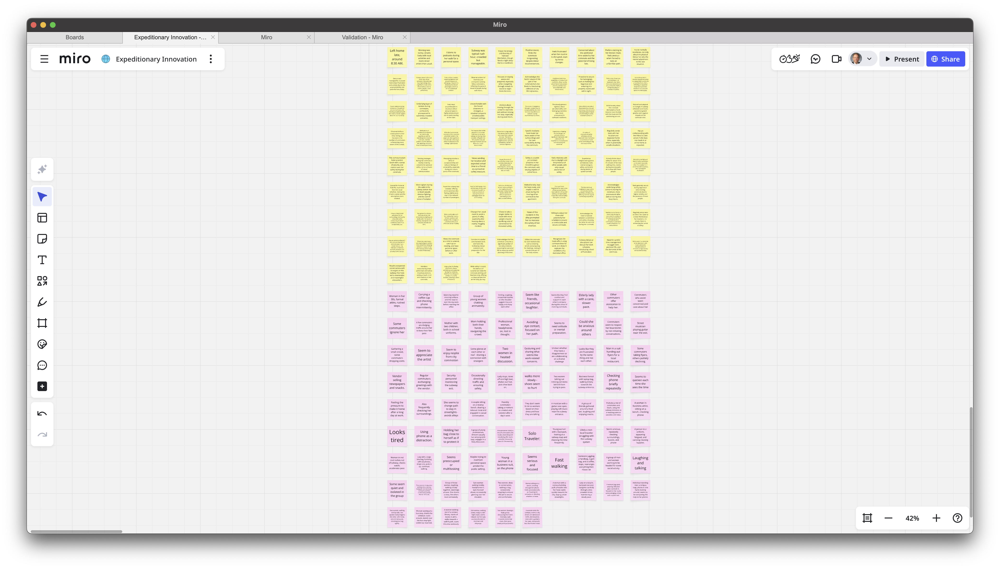
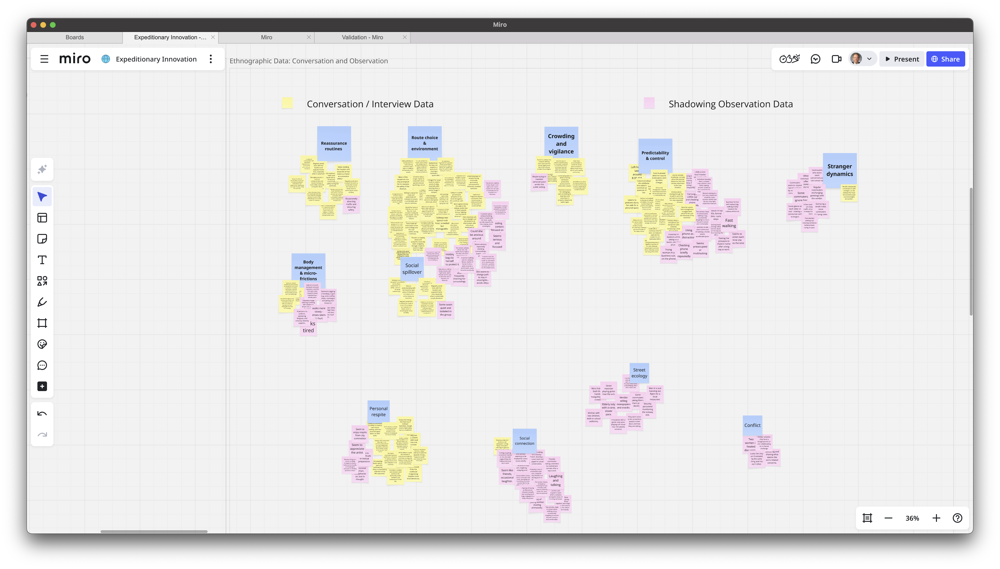

# Clustering Themes {#sec-cluster-ha .unnumbered}

#### From scattered observations to working themes {.subtitle} 

> Following the toolkit naming conventions, this file is named `exp-06-cluster-themes-2025-03-12.qmd`.

## Overview {.unnumbered}

In this demo, we take the mountain of raw data from [conversations](exp-04.a-results-full-transcript-2025-02-24.qmd) and [observations](exp-05.a-observation-2025-03-05.qmd) and cluster it into themes.  

We demonstrate how we used a **Google Sheet** (one observation per row) imported into a **Miro board** for sticky clustering. It pairs with the Toolkit: [Clustering Guide](../toolkit/Clustering_Guide.qmd).

The goal is to see what frictions, routines, and emotional cues repeat often enough to point toward **hypotheses of pain**.

> **Outputs you’ll see here**  
> – Screenshots of the clustering wall (before/after)  
> – The theme labels we settled on  
> – Narrative explanations for each cluster  
> – Core vs. edge distinction, so you can see which themes anchor hypotheses and which are “refrigerated” for later surprises  

## Files & Links {.unnumbered}

- **Sample dataset (Google Sheet):** [halo-alert-clustering-sample-sheet](https://docs.google.com/document/d/1bXnXDxHQFHoGwALlyIgDc2imnDhtmuR0NqYVRegRgbc/edit?usp=drive_link)
  - One observation per row; ready for Miro sticky import.
- **Miro board (view-only):** [halo-alert-clustering-board](https://miro.com/app/board/uXjVOYyhaPM=/?share_link_id=861713686923) *(optional)*

## 1. Clarify the Unknown

- **Question:** What unmet needs (pains) emerge repeatedly in women’s commuting experiences?
- **Why clustering now:** We’ve finished exploratory conversations and observations. Novelty is dropping; it’s time to **converge** by turning fragments into patterns.

## 2. Inputs We Clustered

We combined **quotes from interviews** and **notes from observations**. Each was reduced to a *single* movable unit (one per sticky).

**Examples of raw observations (short & concrete):**

- “I text my roommate when I leave campus so she can watch my ETA.”  
- Avoids shortcut street; takes a longer lit route; arrives 12–15 minutes later.  
- “Crowded trains make me vigilant; I grip my bag and plan my exit two stops early.”  
- Keys between fingers; bag positioned tightly under arm.  
- Family texts: “Ping me when you’re home.” If no ping by 10:30pm, they call.  

> These are examples only. The **full set** is in the sample sheet.

## 3. Method: Miro + Sheet Import

1. **Prepare the Sheet**
   - Column A = `observation` (one per row).  
   - Optional columns: `source` (interview/observation), `time`, `context`.

2. **Import into Miro**
   - In Miro: **Apps → Sticky Note Import** (or **Paste as sticky notes**).
   - Select Column A; each row becomes a sticky note.
   - Arrange stickies loosely; don’t categorize yet.

3. **Affinity Map**
   - Drag stickies into small groups where **similar meaning** emerges.
   - Start new clusters when a sticky doesn’t fit an existing group.
   - Keep moving until **repetition** and **coherence** feel strong.

4. **Name Clusters**
   - Add a short label (2–4 words) above each group.
   - Write a one-sentence “why this belongs together” note under the label.

> Paper option: write each observation on a sticky note; cluster on a wall; snap photos at each stage.

## 4. Before / After (Screenshots)

**Raw, ungrouped stickies**  

**After grouping & naming clusters**  

<!-- 
::: callout-note
**Reading the wall:** We place **stronger signals** (larger clusters, frequent repeats) near the center and **edge cases** toward the periphery. Oddballs that later attracted friends often became new clusters.
:::
-->

## 5. Resulting Clusters

After clustering, we sorted themes into **core clusters** (strong repeated signals) and **edge clusters** (smaller, but worth keeping).  

Core = likely to anchor hypotheses.  
Edge = stored in the “refrigerator” for surprises later.

### Core Clusters

1. **Reassurance Routines**  
   - *Inside:* “Text when you leave/arrive,” timed check-ins, live-tracking links.  
   - *Why it holds:* Shared acts that transfer anxiety from walker to trusted other.  
   - *Signal:* Frequent; across late-evening and unfamiliar routes.  

2. **Social Spillover**  
   - *Inside:* Family anxiety, roommate stress, “call me if no ping.”  
   - *Why it holds:* Pain extends beyond the walker to their network.  
   - *Signal:* Moderate; strongest after 9:00pm.  
   - *Note:* Could be treated as a sub-cluster of Reassurance, but distinct enough to stand on its own.  

3. **Route Choice & Environment**  
   - *Inside:* Choosing lit/busier streets, crossing street to manage spacing, avoiding alleys.  
   - *Why it holds:* Micro-decisions that trade convenience for predictability and visibility.  
   - *Signal:* Strong; often co-occurs with Reassurance.  

4. **Crowding & Vigilance**  
   - *Inside:* Gripping bags, scanning, discomfort in forced closeness.  
   - *Why it holds:* Overcrowding heightens vigilance and amplifies stress.  
   - *Signal:* Moderate-high.  

5. **Predictability & Control**  
   - *Inside:* Frustration at detours, anxiety when late, recalibrating when routine breaks.  
   - *Why it holds:* Security comes from routine; disruption sparks unease.  
   - *Signal:* Strong, consistent across sources.  

6. **Body Management & Micro-frictions**  
   - *Inside:* Footwear discomfort, juggling bags, fatigue, instinctive flinches.  
   - *Why it holds:* Small bodily frictions accumulate into real stress.  
   - *Signal:* Smaller, but recurring.  

---

### Edge Clusters

7. **Stranger Dynamics**  
   - *Inside:* Respectful distance, offers of help, ignoring slower commuters.  
   - *Why it holds:* Social interactions with strangers shape comfort.  
   - *Signal:* Small, situational.  

8. **Respite (Personal)**  
   - *Inside:* Podcasts, daydreaming, phone scrolling, headphones as shield.  
   - *Why it holds:* Solo commuters carve out mini “bubble zones.”  
   - *Signal:* Individual but common.  

9. **Connection (Social)**  
   - *Inside:* Chats with friends, shared meals, group laughter.  
   - *Why it holds:* Commute as social ritual, not just transit.  
   - *Signal:* Small, but meaningful.  

10. **Street Ecology**  
   - *Inside:* Vendors, buskers, security staff.  
   - *Why it holds:* Environmental features that color mood, sometimes add safety.  
   - *Signal:* Thin cluster, but vivid.  

11. **Conflict/Frustration**  
   - *Inside:* Heated discussions, blocked paths.  
   - *Why it holds:* Social friction; not large, but worth noting.  
   - *Signal:* Tiny; could merge with Connection.  

## 6. What We Learned

- **Patterns, not anecdotes:** Seeing multiple notes echo the same idea makes these clusters reliable.  
- **Core vs. edge:** Core clusters give us the best candidates for unmet needs. Edge clusters are weaker signals now but may resurface as hidden opportunities later.  
- **Variety matters:** Conversations gave access to *feelings/thoughts*; observations gave *behaviors/body language*. Together, they balanced the picture.  

## 7. Next Steps

1. Draft **one persona per major core cluster** (unless one persona naturally spans multiple).  
2. Build **experience maps** for each persona’s key activities.  
3. Highlight emotional peaks and valleys to surface **candidate pains**.  
4. Keep edge clusters visible — don’t lead with them, but don’t throw them away.  

::: callout-tip
**The Refrigerator Rule**  
Edge clusters are like leftovers: not dinner tonight, but they keep well. Store them in your “refrigerator” so you can revisit when surprises appear in testing or solution design.  
:::

## Traceability

- **Toolkit links:**  
  - [Guide — Clustering into Themes](../toolkit/Clustering_Guide.qmd)  
  - [Guide — Developing Personas](../toolkit/Persona_Guide.qmd)
  - [Guide — Experience Mapping](../toolkit/Experience_Map_Guide.qmd)

- **Related demos:**  
  - Conversations: [Exp 04.a — Sarah Thompson (summary)](exp-04.a-conversation-sarah-thompson-2025-02-24.qmd)  
  - Observations: [Exp 05.a — Morning Subway Exit](exp-05.a-observation-2025-03-05.qmd)

<!-- 
# Appendix — Import Template (Optional)

If you don’t want to open the sample sheet, here’s the minimal structure that Miro’s sticky importer expects:

`observation,source,time,context` 
`“I text my roommate when I leave campus so she can watch my ETA.”,“interview”,“22:05”,“university → off-campus”` 
`“Avoids shortcut; takes lit route; +12–15 minutes.”,“observation”,“21:40”,“two low-traffic blocks”` 
`“Headphones in, but no music after 9pm.”,“interview”,“21:55”,“earbuds as ‘do-not-engage’ signal”` 
`“Keys between fingers on low-traffic block.”,“observation”,“22:10”,“one burnt-out streetlight”` 
`“Family pings if no check-in by 10:30pm.”,“interview”,“22:30”,“shared stress at home”` 

> In Miro: **Paste as stickies** or use **Apps → Sticky Note Import** and select the `observation` column.
-->

