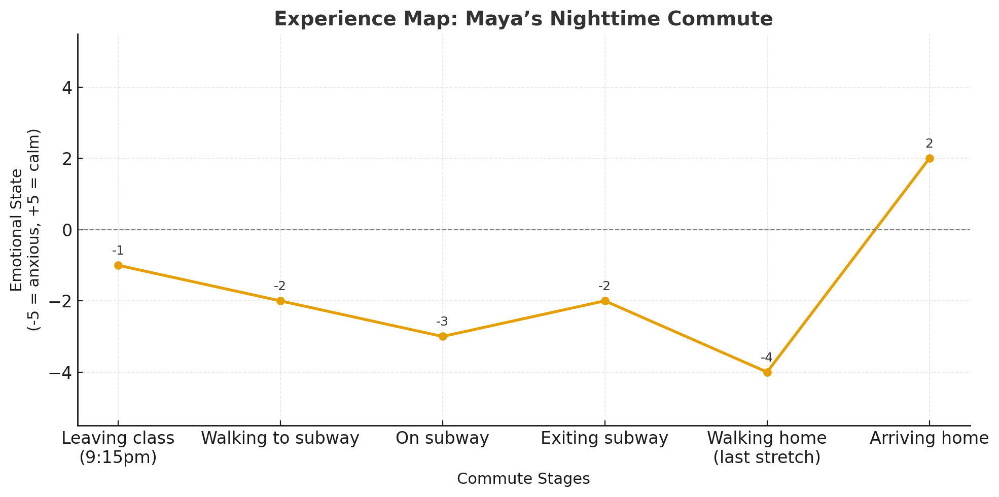

# Experience Map — Maya Patel {#sec-exp-map-ha .unnumbered}

#### Representative journey map for a professional commuter persona {.subtitle}

> Following the toolkit naming conventions, this file is named `exp-08-experience-map-2025-03-14.qmd`.

---

## Overview {.unnumbered}

This demo shows how we move from a **persona** (Maya Patel, 27-year-old accountant in Queens) to an **experience map**: a stage-by-stage trace of her evening commute.  
The map helps us see when Maya’s stress rises, when she finds relief, and how reassurance routines and environmental cues shape her journey.  

The goal is not to list every step but to surface **emotional peaks and valleys** — moments that later become candidate pains for hypothesis generation.


## Journey Context {.unnumbered}

- **Persona:** [Maya Patel](exp-07.a-persona-2025-03-12.qmd)  
- **Goal:** Commute home safely and predictably after work or late evening class  
- **Mode:** Subway + 15-minute walk  
- **Check-in routine:** Text roommate when leaving / arriving  


## Stages of the Commute

One row per stage, one column per lens. Read a column straight down and you are reading a trend across the whole journey, which is the comparison a stack of stage-by-stage notes hides.

::: {.gridded}
| Stage | Doing | Thinking | Saying | Feeling |
|---|---|---|---|---|
| **1. Leaving the Office / Class** | Packs bag, checks phone for time, sends quick text (“heading out now”). | “I hope I didn’t stay too late; the streets will be quieter now.” | “I’ll text you when I’m on the train.” (to roommate) | Mild apprehension; mentally shifts from work to commute mode. |
| **2. Walking to the Subway** | Chooses well-lit streets, keeps keys in hand, avoids alleys. | “Better to add 10 minutes than cut through the dark shortcut.” | None (headphones in, but no music). | Alert; small spike in anxiety on quieter blocks. |
| **3. Entering the Subway Station** | Navigates crowds, scans MetroCard/phone pass, heads to platform. | “I should’ve left earlier; rush hour might still be bad.” | Brief “excuse me” when passing people. | Heightened vigilance; crowd noise and unpredictability increase stress. |
| **4. In the Subway Car (Crowded Segment)** | Holds bag close, avoids eye contact, plans exit two stops early. | “What if I can’t get out in time?” | None — silence as shield. | Stress spikes; pulse quickens when jostled. |
| **5. Transfer or Delay** | Reroutes if platform is packed or if train is delayed. | “This will make me late… I hate not knowing how long.” | Might mutter frustration (“Not again”). | Frustration + anxiety; uncertainty is more stressful than the delay itself. |
| **6. Neighborhood Walk (Final Stretch)** | Walks briskly, stays under streetlights, texts roommate with ETA. | “Almost there. Just two more blocks.” | Sends text: “5 minutes out.” | Anxiety peaks briefly when street is empty; relief grows as she nears her building. |
| **7. Arrival & Check-In** | Unlocks apartment door, texts roommate “home safe.” | “Glad that’s over.” | “Sorry if I made you worry.” | Relief; stress subsides once inside. |
:::

Read the *Saying* column down and something appears that no single stage would have shown: it is empty at two stages, and both are the stages where stress is highest. Maya goes quiet exactly when it is worst.

Notice that most cells carry two clauses — the state, then what produced it. *Heightened vigilance; crowd noise and unpredictability increase stress.* The second clause is the one abduction works from, so it is worth the width. That width is why the grid runs this way round rather than the traditional way, with lenses down the side and stages across the top. Seven stage columns only fit when every cell is a phrase, and compressing these cells to phrases would throw away the causes and keep the labels.

## Emotional Peaks & Valleys

- **Peak stress:** Subway crowding + dark neighborhood blocks.  
- **Moderate stress:** Entering station, reroutes/delays.  
- **Relief moments:** Texting roommate, approaching home, entering apartment.  

<!--  -->

<!--
```{r}
#| label: maya-evening-commute
#| fig-cap: "Maya's Emotional State during Her Commute (Evening vs. Daytime)"
#| fig-width: 8
#| fig-height: 5
#| warning: false

library(ggplot2)
library(dplyr)
library(tidyr)

# Data: emotional state scores (1=very calm, 5=high anxiety)
stages <- c("Leave work", "Walk to subway", "On the train", "Exit station", "Walk home", "Arrive home")

data <- tibble(
  stage = factor(stages, levels = stages),
  Evening = c(-1, -2, -3, -2, -4, 2),
  Daytime = c( 2,  3,3.5,  3,  3, 4)
) %>%
  pivot_longer(cols = c(Evening, Daytime), names_to = "Commute", values_to = "Emotion")

ggplot(data, aes(x = stage, y = Emotion, group = Commute, color = Commute)) +
  scale_color_manual(values = c("Evening" = "tomato", 
                                "Daytime" = "steelblue")) +
  geom_hline(yintercept = 0, linetype = "solid", color = "gray50") +
  geom_line(size = 1.2) +
  geom_point(size = 3) +
  #geom_text(aes(label = Emotion), vjust = -1, size = 4) +   # show values
  scale_y_continuous(breaks = -5:5, limits = c(-5,5)) + #,                     labels = c("Very Calm","Calm","Neutral","Stressed","Anxious")) +
  labs(x = "Commute Stage",
       y = "Emotional State\n (-5 = anxious, +5 = calm)",
       title = "Maya's Emotional State during Her Commute",
       subtitle = "Comparing Evening vs. Daytime") +
  theme_minimal(base_size = 14) +
  theme(axis.text.x = element_text(angle = 25, hjust = 1))
```
-->

<br>

```{r}
#| label: maya-evening-commute-1
# #| fig-cap: "Maya's Emotional State during Her Commute"
#| fig-width: 8
#| fig-height: 5
#| message: false
#| warning: false

library(ggplot2)
library(dplyr)
library(tidyr)

# Data: Maya's emotional state during her evening commute
data_evening <- data.frame(
  stage = factor(c("Leave work", "Walk to train", "On train", "Exit station", "Walk home", "Arrive home"),
                 levels = c("Leave work", "Walk to train", "On train", "Exit station", "Walk home", "Arrive home")),
  Emotion = c(2, 3.5, 3, 3.8, 5, 1.2) # 1 = Very Calm … 5 = Anxious
)

# Plot: Evening commute only
ggplot(data_evening, aes(x = stage, y = Emotion, group = 1)) +
  geom_line(color = "tomato", size = 1.2) +
  geom_point(shape = 21,  # Shape 21 allows for separate fill and border
             colour = "tomato", # Border color
             fill = "white",   # Inner color (creates the "hole" effect)
             size = 5,         # Overall size of the point
             stroke = 2) +    # Thickness of the border
#  geom_point(color = "tomato", size = 5) +
#  geom_text(aes(label = Emotion), vjust = -1, color = "tomato") +
#   geom_hline(yintercept = 0, linetype = "dashed", color = "gray60") +
  scale_y_continuous(
    breaks = 1:5, limits = c(1, 5),
    labels = c("Very Calm", "Calm", "Neutral", "Stressed", "Anxious")
  ) +
  labs(
    x = "Commute Stage",
    y = "Emotional State",
    title = "Maya's Emotional State during Her Commute",
    subtitle = "Emotional peaks and valleys across key stages"
  ) +
  theme_minimal(base_size = 14) +
  theme(axis.text.x = element_text(angle = 25, hjust = 1))
```

## Surprises & Contradictions

- **Social spillover:** Roommate shares the burden of vigilance — safety is a *shared stress*.  
- **Dual routines:** Headphones in (avoid engagement) vs. no music (stay alert).  
- **Relief ≠ relaxation:** “Safe arrival” brings relief but also guilt about making others worry.  


## Building the Grid

The grid is a **bridge format**, not the finished artifact. Three ways to bring it alive on a board or in a classroom:

- **Color-code emotions.** Give each sticky a background color — green for calm, yellow for mild stress, red for peak anxiety. Laid out stage by stage, the color pattern makes the peaks and valleys jump out before anyone reads a word.
- **One sticky per cell.** Each observation becomes its own note in Miro or on paper. It prevents overcrowding and keeps every observation movable, which matters because you will move them.
- **Compare variants.** Map the *same* journey under different conditions — Maya's 9:30 PM walk against her 5:30 PM daylight walk. The contrast shows how lighting, crowd density, and time of day shift the emotional landscape, and it isolates which of them is doing the work.

Use it to structure the raw material before any of it is translated into something presentable.

## Next Steps

1. Compare this map with other personas (e.g., Anika Shah) for similarities/differences.  
2. Highlight **emotional spikes** as candidate pains.  
3. Use abduction to generate multiple **pain hypotheses** from these peaks.  
4. Retain edge-case clusters (footwear discomfort, social interactions) as possible secondary pains.  

---

## Traceability

- **From persona:** [Maya Patel](exp-07.a-persona-2025-03-12.qmd)  
- **From clusters:** Reassurance routines, Route choice & environment, Crowding & vigilance, Predictability & control  
- **Toolkit link:** [Guide — Experience Mapping](../toolkit/Pain_Guides.qmd#sec-experience-map)  

---
